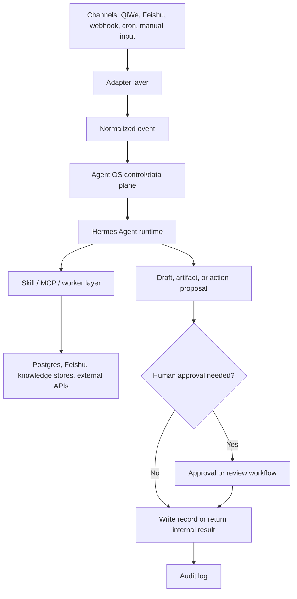

# Agent Contracts

Updated: 2026-07-03

This document defines how Agents, skills, adapters, approvals, and audit records should
interact in Qintopia Agent OS.

## Architecture Contract

## Agent Contract Template

Every Agent package should declare:

| Field                | Meaning                                                |
| -------------------- | ------------------------------------------------------ |
| `agent_id`           | Stable identifier                                      |
| `human_name`         | Human-readable role name                               |
| `owner`              | Human owner responsible for policy and quality         |
| `purpose`            | What the Agent is for                                  |
| `inputs`             | Allowed input types and channels                       |
| `outputs`            | Allowed output types                                   |
| `skills`             | Skills, workflows, and MCP adapters the Agent may call |
| `knowledge_scope`    | Knowledge sources the Agent may use                    |
| `write_scope`        | Objects the Agent may create or update                 |
| `prohibited_actions` | Actions the Agent must not take                        |
| `approval_rules`     | Conditions requiring human approval                    |
| `audit_requirements` | What must be logged                                    |

## Current Agent Boundaries

| Agent     | Boundary                                                                                  |
| --------- | ----------------------------------------------------------------------------------------- |
| Erhua     | Group-facing public-safe replies, consultation capture, trainer-guided memory, escalation |
| Xiaoman   | Activity signal and content-source preparation                                            |
| Huabaosi  | Internal visual material drafts and artifact production                                   |
| Wenyuange | Knowledge lookup, evidence grading, disclosure filtering                                  |
| Silaoshi  | Operations SOP, activity planning, service follow-up, review templates                    |
| Guanerye  | Engineering automation and validation support                                             |

Xiaoqin is not part of the current implementation scope. A future Xiaoqin package must
be designed as a new non-WorkTool Agent integration and reviewed before registration.

## Tool And Skill Contract

Agents should not directly mutate databases or external systems. They should call
governed tools, skills, workflows, or MCP adapters.

Every tool or skill should define:

- input schema
- output schema
- permission scope
- idempotency key when it writes
- audit fields
- risk level
- validation command or fixture

## Approval Rules

Human approval is required for:

- external publishing
- final public use of member stories or identifiable personal information
- price, discount, refund, compensation, contract, or policy exception claims
- complaint resolution
- production route, secret, permission, or deploy changes
- any automated external send that is not explicitly approved

## Audit Rules

Audits should record:

- normalized input summary
- source evidence
- selected Agent, skill, or workflow
- generated draft or artifact reference
- risk labels
- human approval record when required
- final delivery or state mutation
