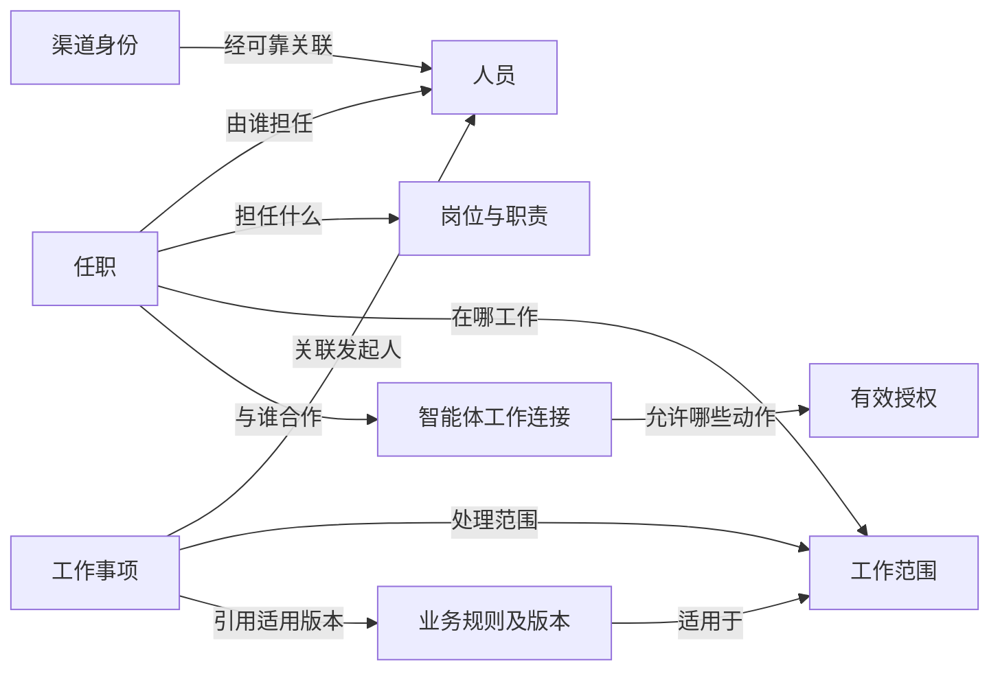
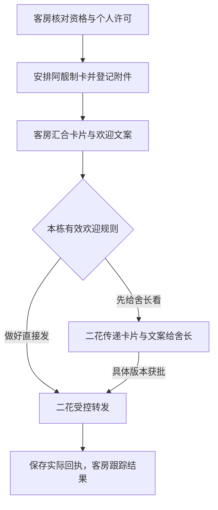
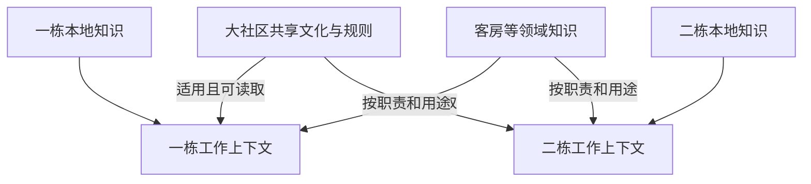

# 社区业务模型：六类对象与二花首个使用场景

日期：2026-09-22。源码核对基线：`0806c2e`。范围：现有模型的增量对照、接入缺口和验收定义。

同日提交收口：当前交付分支已纳入登录主线
`6be9ac1`；本页原始核对和历史验收保留各自版本依据。同步源码不表示 C/D 消费者或真实渠道已经接通。

我们用轻量本体统一业务含义，复用现有 Postgres、身份服务和协作模型。第一步让二花知道当前说话人是谁、在本栋承担什么职责，以及这次事情应如何推进。

本页落实负责人认可的六类对象及“同名不误认、跨栋不越权、离任后失效”三个场景。它是[领域模型](domain-model.md)的具体映射；身份、任职、知识和权限的业务边界仍以[共同契约 §5](../plans/active/unified-person-welcome-v1-contract.md#5-agent-os-数据与受控服务契约)为准。实施顺序沿用[人员与智能体基础建设](../plans/active/person-agent-foundation-execution-plan.md)，不另建人员库或授权体系。

## 1. 本体在系统里长什么样

| 形式             | 保存或表达什么                     | 例子                                       |
| ---------------- | ---------------------------------- | ------------------------------------------ |
| Markdown 定义    | 业务概念、关系和成立条件           | 一个人可有多项任职；每项任职有范围和有效期 |
| 数据库结构与记录 | 对象、具体关系、来源、版本和历史   | 合成人员甲在 A 栋的一项舍长任职            |
| 服务与工具       | 查询关系、校验权限、记录变化       | 查询负责人，核验当前任职，保存受控变更     |
| 对话上下文       | 当前任务允许使用的事实及待确认事项 | 当前身份、适用规则、职责和工作进展         |

定义不是具体人员资料。文档与 schema 随代码管理，真实人员记录、渠道映射和业务历史留在受控数据源。数据库表是本体的一种实现；表名或外键本身不能证明入口已经使用了正确的业务含义。

例如，“舍长”是岗位定义，“甲在 A 栋担任舍长”是一项任职，“这项任职允许修改 A 栋厨房规则”是具体授权。“甲现在说要改厨房规则”则是需要结合当前对话理解的请求。

图表示业务关系，不要求每个方框新增一张表。智能体对本次意图的判断不自动成为事实或授权；需要持久推进的工作才进入任务流程，即时查询无需一律建任务。

## 2. 六类对象对照

### MVP 访问与上下文方案（2026-09-22）

负责人确认：智能体通过受控服务或工具访问业务数据，不开放自由 SQL 执行或通用数据库凭证。

查询负责人、本人职责和动作权限等入口，由后端根据可信身份、任务目的和工作范围查询、裁剪结果；UI 与智能体共用同一套有效身份和授权服务。后端内部可以使用 SQL。

负责人已确认 MVP 优先实现效率，并采用：**按需直接查询现有数据库，关键动作执行前重新校验**。

- 每个需要业务背景的对话轮次，由受控上下文入口集中取得本次必要的身份、任职、范围、规则和相关事项；不要求读取全部资料，也不必让模型逐项调用多个工具。同轮可复用已取得的上下文。
- UI 保存成功后，后续查询读取已提交的有效状态。对话上下文和模型记忆不能作为当前权限的权威依据。
- 修改规则、审核、发布等动作，以及排队任务真正执行前，由后端重新检查当前身份、任职、授权和相关版本；校验与写入遵循既有事务和并发约束，不能仅依赖对话开始时的快照。
- 本切片先不新增跨轮业务上下文缓存或用于刷新智能体记忆的事件通知链路，减少缓存失效、消息投递与恢复的实现成本。已有业务事件、审计和任务恢复机制继续按其原契约使用。
- 先测量实际查询耗时。出现明确性能瓶颈后，再考虑索引、查询合并或必要的缓存；引入缓存时仍保留执行前校验。

这是本切片的后续实施标准，不表示上述消费者接线已经完成。

下表中的“已有”指基线源码中存在结构或实现，不代表真实渠道接通或生产验收通过。身份表前缀为
`qintopia_identity`，协作及任务表前缀为 `qintopia_agent_os`。

| 对象        | 业务含义与边界                                                                                               | 现有数据和入口                                                                                                                                                | 接入缺口                                                                                                                 |
| ----------- | ------------------------------------------------------------------------------------------------------------ | ------------------------------------------------------------------------------------------------------------------------------------------------------------- | ------------------------------------------------------------------------------------------------------------------------ |
| 人员 Person | 稳定的自然人；名称可变，一人可多岗。住客、员工、朋友等关系可以并存                                           | `persons`、`person_aliases`、`member_facts`、`member_profile_snapshots`；`qintopia_member_context_lookup`                                                     | 人员背景与当前任职还未统一交给二花；安全画像不能证明身份、入住或权限                                                     |
| 渠道身份    | 带平台及账号/企业/应用等必要命名空间的外部身份，与 Person 的关联可待确认或撤销；共享工作账号不等于某个自然人 | `channel_identities`、`source_identity_links`；`qintopia_answer_context_prepare` 的身份解析、协作 `Store::actor`                                              | 现有两条解析路径还未连接为实际消费者共用的来源验证与撤销链；跨 Gateway 不能仅凭昵称合并                                  |
| 任职        | 人在某范围担任某岗位，具有任期和历史；工作连接再限定职责、智能体与授权                                       | `collaboration_roles`、`collaboration_duties`、`collaboration_appointments`、`agent_collaborations`、`collaboration_grants`；`Store::decision`、`responsible` | 协作配置已有三态权限；二花旧训练写入仍使用训练员白名单，没有消费这些任职与授权                                           |
| 工作范围    | 社区、楼栋、业务及其受控层级；群与范围显式绑定，群名不授予权限                                               | `collaboration_scopes`、`collaboration_scope_bindings`、`collaboration_audiences`；`Policy::in_scope`、`contact_decision`                                     | 当前群的 Space 能力策略与人员职责授权尚未统一用于二花执行；动态在住人员范围还需消费 PMS 来源                             |
| 业务规则    | 某范围内经有权者确认、在特定时间生效的规则；线索、建议和模型推断不能直接替代正式规则                         | `erhua_training_notes`、`erhua_persona_overlays`、`qintopia_knowledge`；`active_training_guidance`；协作中的 `confirm_knowledge` / `change_rules` 权限定义    | 既有训练记录不等于楼栋规则版本库；当前 persona overlay 读取没有楼栋条件。需落实范围、版本、确认、替代/撤回及实际消费约束 |
| 工作事项    | 一次需要持续处理的请求及其进度；发起人、代办者、执行者、确认人分别留证                                       | `work_items`、`work_item_events`、`artifacts`、`human_workbench_refs`；operations 工作流与状态查询                                                            | 尚缺本场景从可信对话进入知识/约定处理的接线；须保留授权与规则版本，并在实际写入前重验，不能只用聊天文本宣告完成          |

住宿和群成员关系是上述对象使用的外部事实。PMS 负责实际住宿事实，申请来源负责申请与展示同意，渠道负责群成员状态；Agent
OS 维护关联和工作状态。入群不等于入住，Person 也不以有申请为准入条件。

### 可复核的实现位置

- 人员、账号、成员事实和安全画像：[初始数据层迁移](../../runtime/postgres/migrations/202606240002_agent_os_data_layer.sql)、[Postgres Context 契约](../../skills/postgres-context/README.md)、[上下文实现](../../runtime/sidecar/src/context_tools.rs)。
- 来源身份关联：[欢迎与来源身份迁移](../../runtime/postgres/migrations/202609090001_resident_welcome_v1.sql)。来源身份与旧渠道身份表同时存在不意味着二者的撤销自动同步。
- 任职、授权与范围：[协作数据设计](../../runtime/postgres/docs/data-design/2026-09-10-person-agent-collaboration-v1.md)、[协作模块说明](../../runtime/sidecar/src/person_collaboration/README.md)、[Policy](../../runtime/sidecar/src/person_collaboration/model.rs)、[Store](../../runtime/sidecar/src/person_collaboration/store.rs)。
- 业务规则相关旧存储：[训练记忆迁移](../../runtime/postgres/migrations/202606290006_erhua_training_memory.sql)。`active_training_guidance`
  的 persona 查询按状态、期限和优先级过滤，没有楼栋过滤；不能把本栋规则直接写成全局 overlay。
- 工作事项：[控制面迁移](../../runtime/postgres/migrations/202606300007_operations_control_plane.sql)、[operations 实现](../../runtime/sidecar/src/operations.rs)。已有任务类型各自有契约，不能直接拿海报或欢迎任务类型承载任意知识修改。
- 群级能力：[Sidecar 入口](../../runtime/sidecar/README.md#ordinary-qiwe-group-turn-policy)。Space 的有效能力限制渠道执行上限，不能替代当前自然人的业务授权；实现仍有独立启用门禁。

已有 `qintopia_graph`
是从事实生成、可重建的[关系投影](../../runtime/postgres/docs/data-design/2026-06-24-agent-os-data-layer-v2.md#qintopia_graph)。

它可以辅助关系检索，不成为另一套人员或授权事实源。本切片不要求引入图数据库、OWL 或 RDF。

## 3. 第一个使用场景

以下人员、账号和楼栋均为虚构示例，不是实际任命或规则。

合成人员甲是 A 栋当前舍长；其已核验账号与 Person 关联，当前职责明确允许其自主修改 A 栋厨房规则。乙与甲同名，但没有这项授权。甲对二花说：

> 以后厨房晚上十点关，帮我提醒一下。

目标处理过程：

1. 从来源已验证的渠道上下文取得账号和当前会话，查询有效 Person 关联。模型输入中的姓名或
   `person_id` 不能覆盖真实发起人。
2. 解析当前范围，查询本次允许使用的背景、任职和规则。多项任职或多个范围无法唯一确定时，只澄清影响本次处理的范围。
3. 把“修改关闭时间”和“提醒”分别理解；已明确确认的规则未指定生效时间时，成功保存后立即生效，指定未来时间则按该时间生效。提醒对象、开始日期或触发方式缺失时，补齐提醒所需信息，不自行建立固定频率。
4. 依据当前职责判断自主、需指定人确认或未授予。内容和范围明确的修改指令本身算确认；具有相应自主权限时由服务直接保存，成功后告知结果。建议性表达保持提议，实质歧义才追问；需要指定他人确认的权限仍等待相应确认。陌生人仍可提供建议和查询公开信息。
5. 对需要持久处理的事项记录请求、适用范围、来源与版本。待确认内容不进入正式规则；选择确认人不等于确认已经发生。
6. 实际保存规则或执行后续动作前，重验身份、任职、授权链、范围、规则版本和渠道能力上限。队列中的旧请求不因已受理而保留失效权限。
7. 根据持久回执先回复修改人，说明修改结果和生效时间。群通知在有效授权范围内按舍长与二花事先约定执行，未约定时不自动群发；提醒的创建与实际发送分别核实，不把受理说成送达。

当前状态：身份查询、协作判断和持久任务分别有实现；上述完整对话链路尚未接通。本地脚本化模型只能检验系统如何处理给定意图，不证明真实模型能够稳定理解所有表达。

### 已确认的指令含义与验收例子

负责人于 2026-09-22 确认：**明确的修改指令算确认，保存后告知结果；建议性表达先作为提议，关键信息有歧义时再追问。**权威条款见[共同契约](../plans/active/unified-person-welcome-v1-contract.md#本栋规则的修改指令负责人确认2026-09-22)。

以下为后续实现的验收例子，默认当前发起人的身份、范围和权限由可信服务核验，不是本轮已执行测试：

| 输入                                                   | 应有结果                                                         |
| ------------------------------------------------------ | ---------------------------------------------------------------- |
| 有相应自主权限的舍长说“把本栋厨房关闭时间改成晚上十点” | 指令本身算确认；受控保存后告知结果和生效时间，不再追加一次确认   |
| 舍长说“我觉得十点关可能更好”                           | 记录提议，保持现行规则，不能回复“已修改”                         |
| 舍长说“把厨房关闭时间改早一点”，上下文也没有明确时间   | 只追问缺少的目标时间，尚不修改正式规则                           |
| 当前权限需要指定他人确认，发起人给出明确修改指令       | 保留已明确的修改请求，仍等待指定人的有效确认，不自动升为自主权限 |

### 已确认的生效时间与验收例子

负责人于 2026-09-22 确认：**已经明确确认的本栋规则，未指定时间则成功保存后立即生效；指定未来时间则按该时间生效，二花在回复中说明。**权威条款见[共同契约](../plans/active/unified-person-welcome-v1-contract.md#本栋规则的生效时间负责人确认2026-09-22)。

以下时间均为合成场景中已明确的社区本地时间，用来验收后续实现；不是本轮已运行的测试：

| 场景                                                           | 应有结果                                                                   |
| -------------------------------------------------------------- | -------------------------------------------------------------------------- |
| 舍长已确认修改，未指定生效时间，9 月 22 日 15:00 保存成功      | 从本次成功保存起生效；回复说明实际生效时间，不再单独追问该字段             |
| 舍长已确认修改，指定 9 月 23 日 08:00 生效，前一天下午保存成功 | 回复已保存及未来生效时间；08:00 前使用原有效规则，之后使用届时有效的新版本 |
| 请求收到但尚未成功保存，或保存失败                             | 不声称已保存或已生效；按原有效规则处理                                     |

未来生效的版本与当前有效版本必须可区分；“已确认”不等于“现在适用”。规则保存回执和后续提醒/通知是不同结果，不因规则生效自动扩大通知范围或创建发送授权。

### 已确认的通知方式与验收例子

负责人于 2026-09-22 确认：**修改成功后先回复修改人，说明结果和生效时间；群内通知按舍长与二花事先约定、在授权范围内自动执行，尚未约定时不自动群发。**权威条款见[共同契约](../plans/active/unified-person-welcome-v1-contract.md#本栋规则修改后的通知负责人确认2026-09-22)。

以下为后续实现的验收例子，不是本轮已执行测试：

| 场景                                               | 应有结果                                                                                   |
| -------------------------------------------------- | ------------------------------------------------------------------------------------------ |
| 规则保存成功，尚无群通知约定                       | 在当前获准对话中回复修改人，说明结果和生效时间；不自动向其他群或个人发送                   |
| 规则保存成功，已有有效通知约定和覆盖本次通知的授权 | 先回复修改人，再按约定目标、时机及内容执行群通知，无需重复申请同一权限                     |
| 存在历史通知约定，但执行时相应授权已失效           | 拒绝失去授权的发送；规则保存结果和通知未完成状态分别呈现                                   |
| 规则保存成功，通知失败或结果未知                   | 保留真实保存结果，如实报告通知状态；不谎称已通知，结果未知时沿用先核对、不得盲目重发的契约 |

## 4. 三个验收场景

每项都需要配置层证据与实际消费者证据；前者通过不能替代后者。正向场景必须先成功，避免把所有请求一律拒绝当作隔离正确。

| 场景       | 输入与变化                                                                         | 完成标准                                                                                                 | 已有覆盖与缺口                                                                                           |
| ---------- | ---------------------------------------------------------------------------------- | -------------------------------------------------------------------------------------------------------- | -------------------------------------------------------------------------------------------------------- |
| 同名不误认 | 甲乙同名；只有甲账号可靠关联且具备 A 栋权限。再用未关联账号发起同一请求            | 已确认账号命中各自 Person；模糊称呼进入候选澄清；未关联账号不能借同名获得背景或权限；拒绝时无规则写入    | 台账测试已有同名独立记录及待核验人员不可任命；上下文测试已有歧义拒绝。可信消息到规则写入的联合链路待实现 |
| 跨栋不越权 | 甲先处理获授权的 A 栋规则，再请求修改 B 栋规则或提供 B 栋标识                      | A 栋可按有效权限处理；B 栋请求被拒绝，B 栋受限规则不进入上下文；改请求参数或引用旧上下文不能绕过         | 协作测试已有范围、委托与触达隔离；本栋知识检索与实际写入口尚未消费这套授权                               |
| 离任后失效 | 甲的请求已受理但未执行时结束任职；随后重放请求、恢复人员台账，并核对其另一独立任职 | 原请求在真正写入前拒绝，规则与执行副作用为零；恢复台账不恢复旧授权；其他仍有效的独立任职按其自身规则处理 | 协作测试已有换任、结束连接、恢复不复活与保留其他工作；待执行二花知识事项的重验与副作用断言尚缺           |

已有可复用测试入口：

- [协作数据库测试](../../runtime/sidecar/src/person_collaboration/duty_store_tests.rs)：`organization_lifecycle_disambiguates_people_and_never_resurrects_grants`、`contact_scope_and_hierarchy_are_explicit_and_revocable`、`replacing_and_ending_connections_is_atomic_and_leaves_other_work_intact`。
- [协作场景测试](../../runtime/sidecar/src/person_collaboration/tests.rs)：`delegation_handover_proxy_expiry_and_identity_revocation`、`cross_tenant_group_bounds_and_authenticated_http`。
- [身份上下文测试](../../runtime/sidecar/src/context_tools.rs)：`answer_context_identity_reports_conflict_for_multiple_qiwe_people`、`member_name_resolution_does_not_fallback_when_chat_scope_is_ambiguous`、`member_name_resolution_does_not_platform_fallback_for_current_chat_scope`。

## 5. 接入顺序和交付判断

1. **模型对照**：本页把六类对象映射到现有定义、存储、接口及缺口；不新增平行模型。
2. **最小本地消费者**：在既有人员和授权服务上，接可信合成会话、范围裁剪、规则版本及写入前重验；用测试适配器观察实际持久结果。不能只串联几个查询，或复制一套权限判断到 mock 中。
3. **二花对话接线**：沿用同一服务接入二花工具与运行时适配层；在同一请求链中执行上述三项验收。真实来源映射、实际模型与渠道分别验收。

当前 `Store::local` 及事务入口限定 synthetic
tenant，不能靠删除这一门禁接入真实会话。群级 Space 能力、旧训练白名单与新任职授权的衔接必须确定单一授权权威，拒绝或服务不可用时不得回退宽松旧路径。

工作台账号登录已于 2026-09-22 通过
[PR #717](https://github.com/qintopia-agent-studio/qintopia-agent-os/pull/717) 合入主线
`6be9ac1`，当前交付分支已纳入该成果；本页原始核对基线仍为
`0806c2e`。接线时复用合并后的成果，不重放旧登录分支或复制第二套账号系统。账号登录已有权限校验，但不自动证明 QiWe 自然人映射或二花业务授权已接通。

涉及业务源码的下一切片，应先在[共同契约](../plans/active/unified-person-welcome-v1-contract.md)及包文档明确可信入口、规则版本存储、唯一代码责任和消费者边界，再实施。生产发布、真实外部发送、权限扩展及旧流程切换保留各自门禁。

本页及文档索引可独立交付。完成这份对照不计为二花接入完成；完整对话和三项消费者验收仍须由实际实现与执行证据关闭。

本轮实际检查、Rust 场景未运行的环境原因和项目级检查的独立阻断，见[2026-09-22 验证记录](../reports/2026-09-22-community-business-model-validation.md)。

## 6. 认识住客与促成交流

### 已确认的目标与本轮证据范围

负责人于 2026-09-22 明确：兴趣爱好、技能与可贡献资源、称呼及沟通习惯都在关注范围；希望二花通过沟通认识社区的人，活跃交流气氛，也可以展示本人近期动态。前提是尊重个人隐私，并结合现有数据完善设计。负责人特别提出年龄和申请中不同意展示卡片的情况，需要认真处理。

负责人随后确认年龄默认不用于社交介绍、事实需保留来源与使用边界、LLM 应承担更多记忆维护，以及同群接话和人物介绍分别判断授权；又明确来过一次即长期属于社区，记住成员及历次经历，同时更新当前状态。正式边界见[共同契约 §5.5](../plans/active/unified-person-welcome-v1-contract.md#55-住客记忆维护与个人展示边界负责人确认2026-09-22)。长期保留原则已确认，下文其余产品体验和具体入口仍为讨论建议；本轮不执行真实采集、生产存储变更或对外发送。

### 一直记得成员，同时知道状态（已确认）

“社区成员”与“当前住客”分别表达长期关系和本次状态。离店后仍是社区成员；下次回来接续同一人的历史。长期未互动不会自动清除成员和获准保存的社区记忆。

| 要记住的内容     | 例子与使用方式                                                                             |
| ---------------- | ------------------------------------------------------------------------------------------ |
| 这个人及社区关系 | 小林是来过社区的成员；可靠账号关联到同一 Person，离店或换群不另建一人                      |
| 历次经历         | 第一次实际入住的起止时间、后来再次入住的记录；保存有来源的时间线，不用最近一次覆盖以前     |
| 当前状态         | 当前在住即在社区；已离店且无其他有效在住记录时按不在社区处理；来源不明则待确认，带更新时间 |
| 有时间的个人记忆 | 记得他以前提过摄影，称呼沿用有效偏好；不把旧兴趣、上周的帮助意愿当作今天的承诺             |
| 本次允许的使用   | 可以接续获准的交流背景；向别人介绍仍须符合有效的内容、用途与受众许可                       |

例如小林先来住了一次，离店后社区仍然记得他；几个月后可靠来源确认他再次入住，系统应关联同一 Person、新增本次住宿，并能在获准的本人交流中接续往事。再次入住不自动恢复旧任职、旧展示许可，也不自动授权向群里播报其行程。

负责人已明确“当前在住”就当作“在社区”，不区分社区与现场。此业务状态直接采用有效 PMS 住宿事实；不额外记录临时外出、位置或现场在场。来源未知时仍标明待确认，离店改变当前状态，不抹掉长期社区成员关系。

已确认的四类处理是：称呼保持到本人更正或要求停止使用；兴趣保留来源和时间，不断言永久有效；短期帮助意愿到期不再用于安排；单次介绍许可不变成长期许可。**保留这段历史，不代表它现在仍有效或可以公开。**本人更正、停止使用与撤回的既有边界继续适用。

实现上继续复用 Person、成员关系、住宿和个人事实；具体映射见下文数据设计。完整历史、状态更新与回来后接续交流仍待消费者验收，本节记录的是已确认目标。

本轮核对数据库迁移、画像与上下文源码，以及 2026-09-09 复核的[人员基础盘点 §6.1](../plans/active/unified-person-identity-foundation-assessment.md#61-本轮只读现场结果)。没有查询生产记录、原始聊天或住客照片，未测量字段填写率、同意比例、身份关联率或资料新鲜度；字段存在及源码能力不等于每位住客都有对应数据，也不证明当前线上已启用。

### 非住宿来访暂缓与自动捕捉边界（已确认）

负责人已决定非住宿来访记录以后再讨论，当前停止推进，不随共同记忆服务接通自动排入开发。此前由接待者或活动负责人额外告诉智能体“谁来过”的方案已撤下；不能以补录、登记、确认名单或提醒工作人员提供线索作为前提。

未来若重启，只评估智能体利用已有且获准的群聊、社区活动记事本等自然信息自动捕捉的能力。工作人员无须为智能体专门写记事本、改变日常记录方式或维护字段。信息不足时允许不知道；身份或到访依据不清楚时保留受限线索或暂不记录，不追问工作人员，不创建人工核实队列。

已有自然信息也须区分报名、计划、实际发生和他人转述；名字相同不自动合并人员，模型推断不直接升级为确认事实。现有活动报名和人数不证明逐人实际出席，社区活动记事本也尚未核对接入。此方向不制造 PMS
Stay、不改变“在住即在社区”的口径，记忆用途仍受已确认隐私边界约束。

本节仅保留暂缓决定和未来边界，不新增采集任务、字段实施、交付日期或访客登记系统。当前继续完成已有住宿成员的记忆闭环。

### 现有数据可以支持什么

| 数据来源及已有结构                                                                                                                     | 可支持的体验                                                   | 需要补齐的判断                                                                         |
| -------------------------------------------------------------------------------------------------------------------------------------- | -------------------------------------------------------------- | -------------------------------------------------------------------------------------- |
| 入住申请：历史字段盘点确认有称呼/姓名、职业/兴趣、照片、展示同意、预计入住、计划天数、期望房型、公式年龄段及欢迎卡片附件，共 20 个字段 | 用本人填写且允许展示的内容形成初次介绍；本人选择的称呼用于交流 | 展示同意只覆盖相应内容；公式计算出的年龄段也需遵守披露范围；不能从存在字段推导公开许可 |
| `persons`、`person_aliases`：偏好称呼、别名、身份关系                                                                                  | 跨入口记住同一个人，避免反复问称呼或认错同名住客               | 可靠身份关联；公开称呼不应自动回退为证件姓名                                           |
| `member_facts`：来源、证据、置信度、观察时间、有效期、撤销时间与可见性                                                                 | 保存有来源的兴趣、沟通偏好及可供后续确认的线索                 | 事实是否真实和是否可公开分别判断；现有内部可见性不足以单独表示具体用途和受众授权       |
| `person_interaction_summaries`、`member_profile_snapshots`：交流摘要、回复风格、安全回复提示和禁止披露项                               | 自然接续交流，按本人偏好调整回复                               | 内部回复背景不是公开人物简介；生成摘要也不能扩大原材料的使用范围                       |
| 群消息、`event_signal_candidates`、`event_signals`：活动、求助、内容故事等线索，有来源群与时间；事件默认内部运营用途                   | 发现可邀请本人分享的近况、活动意向或合作机会                   | 询问活动不等于报名或出席；运营信号和日报不能直接变成住客动态推送                       |
| PMS 住宿事实、群成员关系及任职授权                                                                                                     | 确定服务范围和当前负责人，避免发错群、找错人                   | 房号、行程、支付等管理数据不因参与社区互动而成为社交素材；入群不等于在住               |

实现证据：

- 人员及画像表：[初始迁移](../../runtime/postgres/migrations/202606240002_agent_os_data_layer.sql)。
- 事件线索：[事件迁移](../../runtime/postgres/migrations/202606270005_event_signals_v2.sql)。
- 画像生成：[member_profile.rs](../../runtime/sidecar/src/member_profile.rs)。
- 上下文边界：[Postgres Context](../../skills/postgres-context/README.md)。
- [现有日报契约](../../runtime/postgres/docs/data-design/2026-06-26-profile-digest-archive-v1.md)明确日报属于内部运营材料，不能自动发回群。

源码中值得优先完善的两处：

- 画像提取目前用 `interest_or_skill`
  合并兴趣、技能及提供帮助的表达。后续应区分“喜欢摄影”“会摄影”“愿意帮别人拍照”“这次有空”，不能把兴趣变成技能认证或服务承诺。
- `member_safe_context` 按 Person 选择有效 `reply_context`
  快照；当前群参与身份判断，但快照选择本身没有按该条事实的来源群、用途和本人展示同意裁剪。现有“安全摘要”命名、敏感文本遮盖或禁止披露提示不能替代这一校验。应在服务端裁剪后再交给模型。

### 建议先做的三种体验

1. **按本人偏好交流。**记住获准保存的称呼、回复长短和互动边界，适时接续本人提过的话题。“这周想安静”作为有时效的边界，不生成“内向”“不合群”等人格标签，也不在群里解释其私下原因。
2. **双方愿意时牵线。**先匹配兴趣或需求，再依据双方有效约定确认是否愿意被介绍；没有约定时只问本人，不能先向对方透露姓名、需求或联系方式。会某项技能不等于愿意承担工作；有效持续约定已覆盖的牵线无需逐次重复确认。
3. **本人可控的近期动态。**优先选择本人明确愿意分享的作品、项目进展、活动邀请和求助；保留发生时间、来源、受众和有效状态。过期邀请、已解决求助、撤回内容不继续推荐，旧资料不能包装成“最近”。二花的楼栋交流与小满的社区活动协作，复用已有任务流程，避免重复打扰。

互动质量建议用“本人愿意参与且对方有回应的交流、实际促成的合作、拒绝或打扰反馈”评估；不把发消息数量、强制点名或少数活跃成员的持续曝光当作成功。安静参与和暂不社交也是正常选择。

### 隐私与展示边界

年龄默认值与同群作品场景已确认，其余建议及入口实现状态分别标明；不能把本表全部视为已实现功能。

| 问题                 | 已确认边界或讨论建议                                                                                                                                                                                                 |
| -------------------- | -------------------------------------------------------------------------------------------------------------------------------------------------------------------------------------------------------------------- |
| 年龄及年龄段         | 已确认默认不用于社交介绍；当前没有独立选择入口，欢迎卡片同意不能代替年龄披露许可。建议不借照片或毕业年份推算补齐，不按性别猜测偏好；具体选择入口见下文                                                               |
| 不同意卡片展示       | 记录这项明确拒绝，不生成“隐私敏感型”人格标签；无另一项具体授权时，也不把同一份申请资料改成文字介绍或动态榜单发布。本人仍可在当前交流中主动分享，正常服务不受影响                                                     |
| 同意卡片展示         | 沿用已确认的社区大群、对应楼栋群及员工内部群范围，仅限相应展示内容；不自动涵盖私聊、未来近况、长期人物报道或其他字段                                                                                                 |
| 同群接话与再传播     | 已确认未同意卡片者在楼栋群分享作品时，二花可以当场自然接话；纳入“本周摄影伙伴介绍”需本人对该用途的授权。建议后续摘要、跨群转发也分别核对用途和受众，不把曾经说过等同于持续发布同意                                   |
| 私聊、管理资料和推断 | 私聊只作获准的本人服务背景；证件、电话、具体房号、精确行程、支付、健康、收入、婚恋等不作默认社交素材。性格、情绪、关系等猜测不作为可公开事实                                                                         |
| 员工与舍长的权限     | 运营者能审核文案或决定发送节奏，不能因此代替本人同意披露个人信息；内部群也不是无限制可见                                                                                                                             |
| 更正、撤回和近期状态 | 本人应能查询“记住了什么、会用于哪里”，更正或停止某类使用；撤回后重新裁剪上下文、使受影响摘要和未发任务失效。已发内容按渠道能力处理并如实说明，不能承诺抹除他人已看到的信息；必要业务审计与可选社交记忆的保留分别设计 |

“能否记住、用于本人服务、对某些人展示、主动联系或介绍”是不同决定。不能只用一个“公开/隐私”标签代替，也不能以不显示姓名保证小社区中的匿名性。

轻量模型在每条可使用事实旁表达：**是谁的什么信息、来源与确认状态、适用用途与受众、观察/发生时间及有效期、允许或拒绝的依据和撤销状态**。这描述的是应有业务含义，不代表以上字段和校验已全部实现。优先扩展现有事实、同意版本与受控上下文，不建立第二个人员库或由模型维护的权限表。

### 本人从哪里选择（候选实现，尚未接通）

现有申请表仅有欢迎卡片是否展示，不能要求住客操作不存在的年龄开关。MVP 建议不新增必填表单字段：卡片同意继续按既有用途使用，年龄及年龄段默认从社交输出中排除；另有本人明确许可且服务已支持时才使用相应例外。

建议以本人和负责当前业务的智能体的可信对话作为补充选择入口。例如向客房智能体说“这张欢迎卡片可以写我的年龄，只发本栋群”，由其解析内容和范围，调用统一服务保存，再由客房流程安排阿靓制卡。若住客先向二花表达同一选择，二花可经受控服务保存并交客房流程处理，不自行发起制作或改卡。“我今年二十八岁”只表达事实，不能当作发布许可。

明确指令已有可靠上下文时不再增加一次泛化确认；只有授权对象、用途或范围有实质歧义时才澄清。住客可从哪个已接通渠道表达选择，与哪个智能体承担制卡或发布职责分开；所有入口消费同一份有效选择。

保存位置是 Agent
OS 中关联 Person 的版本化个人信息使用记录，与申请来源及同意版本保持关联；不要求把每次对话选择回写成申请表新列。允许、拒绝、撤回及其覆盖的内容/用途/受众需要可核验，具体表和命令在实现时增量设计。针对一张卡的例外不变成永久或全社区许可。

“以后介绍我别提年龄”“不要再把我列进伙伴介绍”等明确缩小范围的要求，同样通过此入口撤回相应用途；身份未核验不能修改另一个人的记录，有歧义时先停止本次有争议的披露。保存成功才回复已记录。未接通前应说明入口尚不可用，并继续按不披露的默认值处理，不能靠聊天承诺伪造已保存。

“查看二花记住了什么、修改或停止使用”的对话能力可复用同一服务；可视化设置页和表单细项以后按需要补充。该候选方案不授权开发者代替住客选择展示，也不要求逐个向住客询问年龄。

### 这些字段由谁维护（分工已确认，接线待实现）

负责人已认可以下分工，并明确**不增加人的日常工作量**。LLM 和后端承担提炼、关联、去重、更正、时效及来源维护；运营人员不承担补全画像的任务，住客不需要为系统另填资料。

| 信息或操作                       | LLM 的工作                                                                   | 系统自动维护与校验                                                                           | 人只需何时参与                           |
| -------------------------------- | ---------------------------------------------------------------------------- | -------------------------------------------------------------------------------------------- | ---------------------------------------- |
| 兴趣、偏好、技能、帮助意愿及近况 | 从获准使用的交流提炼候选，区分本人陈述、他人转述和推断，识别新增、更正与结束 | 校验信息类别、来源使用政策和更新权限，按事实粒度保存；不能从提到一次升级为认证技能或帮忙承诺 | 本人可自主更正，不要求人工补全画像       |
| Person、来源、记录时间与版本     | 引用当前工具提供的对象与证据，不自行编造身份或时间                           | 从可信会话和来源取得身份、证据引用、消息时间及保存时间；去重、并发冲突和审计                 | 记忆关联不明等待已有证据，不交人逐条核对 |
| 用途、受众和展示选择             | 理解本人明确允许、拒绝或撤回的含义，提出范围明确的受控变更                   | 按既有用途模板、字段边界和本人许可核验；默认与继承规则自动填充，缺少许可不扩大范围           | 本人表达真实选择；负责人确定通用业务边界 |
| 时效、过期、更正及撤回           | 识别“这周”“已经结束”“之前说错了”等变化，提出修订或归并                       | 当前使用排除过期/撤回事实，获准历史查询标明当时时间；失效相关摘要及未执行发布任务            | 本人可自主表达变化，不要求定期清理或核对 |

可选记忆缺失或有歧义时保持未知、等待已有信息更新，不能自动生成工作人员待办、核对提醒或补录表，也不为填满资料主动追问本人。业务本身的必要决定、已约定的内容审核和本人隐私选择仍按既有规则处理；不因完善记忆额外发起一轮人工确认。

获准范围内、来源清楚的普通自述或偏好可以由工具自动持久化，不要求人工逐条维护；可收集的类别、保留规则及处理目的须先配置，不能因此把全部聊天转为永久档案。模型推断保留为候选，不能变成本人确认；自动摘要也不能改变事实的原有用途和受众。

更新应处理单条事实及其版本，保留必要证据，避免整份画像反复覆盖。本人撤回后，旧消息重放、旧提取任务或摘要重建不能重新打开许可。服务端读取最新有效状态，生成前裁剪、实际发送前重验；沿用本页 MVP 按需查询方案，不为记忆维护另建跨轮缓存刷新链路。

### 用一次自然交流验证自动记忆（本地实施建议）

先用已确认的沟通偏好验证共同记忆服务，场景中的住客身份已可靠关联、来源及本人服务用途已获准。以下描述目标体验，尚未接通运行：

| 自然发生的交流           | 系统完成的工作                                     | 后续可见结果                                               |
| ------------------------ | -------------------------------------------------- | ---------------------------------------------------------- |
| “以后回答我简短一点”     | 从可信消息识别本人偏好，保存事实、用途、来源及版本 | 下一次对话读取有效偏好，回复更简洁，无需工作人员登记       |
| “涉及费用还是详细说清楚” | 新增明确适用条件，保留一般简短、费用详细的区别     | 费用问题详细解释，普通问题仍简洁，不用一句新话覆盖全部偏好 |
| “以后不用记我的回复习惯” | 停止相应记忆的使用，阻止旧摘要或消息重放重新启用   | 后续按正常回复规则交流，离店再回来也不恢复已停止的偏好     |

没有明确条件时不替住客编造；只是引用别人的话、身份不明或表达模糊时不更新已确认偏好，也不产生人工核实任务。系统保存成功和实际读取使用分别留可验证结果，不能用一句“记住了”代替持久化。

这一闭环先处理一类偏好，验证可复用的新增、带条件修订、停止使用和受控读取。兴趣、技能、短期意愿及动态继续按已确认类型逐步接入；不为每类信息新建一套人员库，也不重启暂缓的非住宿来访功能。

现有代码已有消息归集、规则提取、事实表、画像摘要和二花上下文入口。缺口在于 LLM 的受控记忆变更、事实与用途版本、读时校验，以及旧画像任务不会覆盖新选择的保障；具体实现切片见[自动记忆闭环安排](../plans/active/person-agent-foundation-execution-plan.md#自动记忆的最小本地闭环实施建议)。

### 接入与验证

已确认的摄影作品场景进入后续验收，不再重复询问。实施责任与顺序见[接入安排](../plans/active/person-agent-foundation-execution-plan.md#住客记忆与展示校验的接入安排2026-09-22)。

先制定最小用途模板及字段边界，使用合成场景检验：只同意卡片不输出年龄、明确许可只用于指定内容和群、陈述年龄不生成披露许可、同群接话不自动授权人物介绍、未知身份不改别人资料、普通获准偏好自动保存、更正有版本、撤回后排队任务及旧消息重放不再发布。另覆盖兴趣不变成帮忙承诺、旧动态不冒充近期。它们是后续验收要求，本轮未运行行为测试。

长期社区记忆另需验证：离店和长期未互动不抹掉成员及获准历史；再次回来关联同一人且不覆盖上次经历；当前在住按在社区处理，住宿事实未知不判断为离开；短期意愿失效后只作为获准历史读取；旧许可、撤回内容及结束的权限不会因再次回来复活。具体用例见[实施计划](../plans/active/person-agent-foundation-execution-plan.md#住客记忆与展示校验的接入安排2026-09-22)。

如需进一步评估数据覆盖，先通过受控只读入口取得字段元数据、去标识的填写率/时间分布/同意状态统计及关联质量；不为讨论导出住客明细。统计只用于判断可落地范围，不用来推断不同意展示者的性格或动机。

## 7. 个人资料的数据来源、保存与演进

本节是依据已核对 schema 和源码提出的增量设计，未新增表或证明下列来源全部接通。人员事实源不因 LLM 能生成文字而改变。

### 来源及各自能证明什么

| 来源                           | 进入个人背景的内容                                                   | 权威范围及限制                                                                                   |
| ------------------------------ | -------------------------------------------------------------------- | ------------------------------------------------------------------------------------------------ |
| 本人填写的入住申请             | 称呼、职业、兴趣、许可范围内的照片引用、展示选择                     | 是本人当时的填写与选择；预计入住或意向房型不证明实际住宿，展示同意不覆盖全部字段                 |
| PMS                            | 实际入住人、本次住宿、安排、在住/离店等必要事实及版本                | 住宿事实源；下单人不自动是每一位实际住客，不把支付、证件或完整订单导入社交背景                   |
| 渠道及可信身份服务             | 账号、群成员状态、账号与 Person 的有效关联                           | 平台身份和群关系；昵称不证明自然人，群成员不证明在住                                             |
| 获准使用的本人交流             | 兴趣、学习需求、称呼、沟通偏好、技能自述、帮助意愿、近期作品或计划   | 保留本人陈述与时间；能力自述不是资格认证，意愿不等于承诺；私聊内容的用途不自动扩大到群           |
| 有权人员的业务操作及已确认流程 | 任职、职责、已经核实的任务完成或社区贡献；活动实际参与需相应有效来源 | 操作者只能确认其职责内事实；发过询问不算出席，创建任务不等于完成，员工不能替本人授予社交展示许可 |
| 他人提及及 LLM 提炼            | 可供核实的线索、摘要、候选关联                                       | 明确标注转述/推断和证据，不自动升级为本人确认，不因多人复述变成权威事实                          |

新增来源先确定字段范围、读取授权、更新/撤回方式和可靠身份关联，再通过受控适配器接入。表单或源事件结构变化应更新适配契约，不让模型靠字段名称猜含义。当前未发现与本人关联的完整活动出席数据链，因此不宣称已采集每个人的真实参与史。

来源冲突按数据领域处理：PMS 决定实际住宿，有权任命服务决定任职，本人明确表达决定自己的偏好或披露选择；不能用“最后收到的文本”覆盖这些事实。本人兴趣变化可以形成后继事实，来源未明确的矛盾先保留分歧；业务发生时间、观察时间和系统收到时间需要区分。

### 保存方式与使用过程

1. **原始事实留在各自来源。**申请留飞书，住宿留 PMS，渠道消息留原有受控消息存储；Agent
   OS 保存完成业务所需的最小投影、来源引用及版本。不复制全部资料到每个智能体，也不因提炼个人事实重复存整段私聊。
2. **稳定 Person 关联多条事实。**每条兴趣、偏好、意愿或近况作为独立的有来源记录；任职、住宿、任务继续使用各自的领域表。长期社区关系、历次来访和当前状态分别表达，当前投影更新不覆盖历史。本人改口时只修订相关事实，不重写整个人的历史。
3. **个人使用许可独立关联。**允许、拒绝、撤回记录关联主体、信息或内容版本、目的及受众；不把“确实喜欢摄影”与“可以公开介绍”挤成一个可信度分数。欢迎的现有布尔同意仍只表达原用途。
4. **摘要按任务生成，可重建。**二花取得本轮交流允许的背景；客房取得欢迎资格和对应许可字段；阿靓只取得本次制卡素材；转发任务只提供指定产物、文案和目标。完整内部画像不会因为同一个 Person 就对所有消费者开放。
5. **执行结果进入业务记录。**保存事实、获得审批、制作卡片、附件登记和群发送分别留证；发送前重新检查规则和个人许可。撤回后失效相关摘要及未发动作，已完成动作按实际回执处理。

这些记录放在现有 Postgres 及受控业务存储中；Markdown 维护类型和规则，Hermes/模型上下文消费查询结果。图片等文件仍用现有附件/Artifact 存储，数据库保存稳定引用、版本和必要 hash，不保存临时 URL 作为永久地址。

### 现有字段是否够用

现有结构足以复用为基础，尚不足以直接支撑完整自动记忆维护和按用途披露。重点是补足业务含义和强制校验，而不是给 Person 不断添加兴趣、近况等固定列。

负责人于 2026-09-22 已确认三类扩展：事实类型与结构、事实修订与核实状态、具体用途与受众许可。下表将已确认要求映射到现有字段及待实现缺口，正式要求见共同契约 §5.5；不再作为待选择的方向反复询问。

| 需要表达的能力             | 已有字段或结构                                                                | 增量缺口（待实现）                                                                                        |
| -------------------------- | ----------------------------------------------------------------------------- | --------------------------------------------------------------------------------------------------------- |
| 谁的什么信息及证据         | `member_facts.person_id/fact_type/fact_key/fact_text`，消息/文档/通用证据引用 | 将兴趣、技能、帮助意愿和当次可用性定义为不同类型；为新来源统一引用及版本校验                              |
| 时间与撤回                 | `observed_at/valid_from/expires_at/revoked_at`，创建/更新时间                 | 明确事件时间与观察时间的区别，补事实修订号、替代关系及并发保护；原表没有完整事实版本链                    |
| 本人陈述、转述、推断及核实 | `evidence_type/confidence` 和 metadata 可作基础                               | 显式表达断言来源、核实状态/人/依据；置信度不能代替核实，也不能让 LLM 随意写 confirmed                     |
| 类型化内容                 | 现有 `fact_text` 和 JSONB `metadata`                                          | 引入受控的事实类型定义、值结构及 schema 版本；工程上选择验证后的 JSONB 或必要列，不把任意 JSON 当有效事实 |
| 具体用途及受众许可         | `visibility/information_class`、画像禁止披露项、申请同意版本                  | 关联本人明确允许/拒绝、目的、受众、内容/事实版本、生效/撤回及证据；原有全局可见性字符串和卡片布尔值不够   |
| 可重建摘要及实际使用       | 快照有 `source_fact_ids/source_summary_ids`，上下文访问审计记录用途和字段     | 补实际来源修订、用途/受众匹配及依赖失效，旧摘要不能绕过当前事实与许可                                     |

完整字段映射见：
[数据设计补充](../../runtime/postgres/docs/data-design/2026-09-10-person-agent-collaboration-v1.md#个人记忆维护与展示选择的补充设计2026-09-22待实现)。

现有证据字段或 JSONB 能存一个值，不代表服务已验证其来源、用途和版本。

### 怎样持续成长

采用稳定的人员、来源、时间和许可骨架，加受控扩展的事实类型。例如新增“正在学习什么”或“愿意借出的设备”，先定义含义、数据结构、来源、时效及使用规则，再让 LLM 使用该类型；无需为每种兴趣添加数据库列。高频需要查询或强约束的领域，再升级成专门关系表和索引。

LLM 可以提出新类型建议，不能自行新增权限含义或把未知类型写成可公开事实。新类型和版本要有合成样例、兼容读取及迁移/重新提取策略；旧记录没有足够来源或许可时保持受限，不通过迁移自动补造同意。

新增智能体复用同一服务按职责取得背景；新增渠道只接适配器和身份来源；新增个人信息类型扩展受控定义。成长既包括新增，也包括更正、遗忘、归档和停止使用，避免长期积累过时或互相矛盾的标签。

## 8. 欢迎流程怎样消费这些资料

本轮明确的职责和两种审核路径以[共同契约 §6.4](../plans/active/unified-person-welcome-v1-contract.md#64-欢迎编排制卡与楼栋转发职责负责人纠偏2026-09-22)为准。客房智能体“岸岸（暂定）”编排，阿靓（`huabaosi`）制卡，二花转发；二花即使接收到住客资料更正，也不因此承担制卡。

图中直接发送以正式入住、目标群成员、个人信息许可等条件持续满足为前提。舍长设置完整欢迎免审时不增加逐次人工关卡；若设置先审则等待实际批准。卡片存申请 Base 的欢迎卡片附件，二花按任务中的稳定产物引用取用；引用、规则及许可的判断由后端落实。

### 本次与持续设置，以及社区负责人的权限边界

负责人已明确舍长可以在权限内设置文案形式、单次转审或一段时间内默认转审，也可以设置获准的直接发送方式。社区负责人通过统一工作台确定舍长的可决定范围。业务分层以[共同契约](../plans/active/unified-person-welcome-v1-contract.md#社区授权舍长设置与具体审批负责人确认2026-09-22)为准。

“这一位先给我看”只改变当前事项；“这一个月都先给我看”改变期间默认，每次内容仍分别审核；“以后按模板直接发”只在舍长取得相应自主权限时成立。舍长可以调整范围内的长期习惯，不必逐条请社区负责人批准；上层设定的必要确认和个人资料披露范围继续约束实际执行。

三个层次分别是：社区授予舍长的决定权、本栋欢迎的默认/本次设置、某次具体内容的批准。原 UI 的自主/需确认/未授予表达第一层；完整的后两层及岸岸—阿靓—二花的消费接线仍需实现，不能因设置页已有权限选项就宣称欢迎流程已接通。

### 2026-09-24 欢迎确认与内容归属补充

负责人进一步明确：照片与欢迎卡片统一，本栋欢迎词、措辞和文案以本栋舍长的有效安排为优先。统一资料/卡片与楼栋欢迎词分别追踪版本；实际发送对应具体组合、本栋审核规则和有效个人披露许可。基础线建议仅口吻调整不重复客房事实确认，事实或披露变化则按影响复核；这项实施建议不取消本栋要求的内容审核。

“秦托邦小客服”指定企微工作账号可作为本轮欢迎确认主体，不要求追溯轮班自然人。身份与审计如实记录工作账号，不伪造某位员工 Person；绑定可信渠道标识、企业作用域及欢迎权限，显示名不作为授权依据。这项决定不自动增加 PMS/收款权限，逐笔收款人工确认继续有效。共同主体和权限接口已在本地实现并完成集成验证；真实渠道尚未验收。

对应企微账号由有管理授权者配置，可选择或更换已验证账号，不硬编码显示名称或特定账号。更换使旧账号的该项岗位确认授权失效，未完成事项按当前有效授权核验；历史确认及审计保留当时主体和展示信息，不改写为新账号。

身份关联的默认路径已明确：保留飞书申请，系统用手机号、姓名、昵称及 PMS 每个实际入住人生成候选；不确定时岸岸在“全村人运营团队”请获授权的秦托邦小客服工作账号或主管确认，UI 展示同一事项。无需另建人工台账，不以二花能主动私聊住客为前提；居民自助核验仅为渠道可达时的可选补充。

确认必须说明“渠道账号 ↔ 人员/申请 ↔
PMS 逐个实际入住人”的哪段关系成立。只确认申请与住宿，不能声称认出了群账号；缺账号或证据仍待关联。姓名相似、手机号相等或只有一个候选均不能自动代替可靠依据或有效确认，付款人也不自动代表全部入住人。

有效确认后系统保存 Agent
OS 关联及来源、确认主体、时间、版本，支持更正/撤销；默认不改 PMS 住宿事实或飞书源字段。此处的身份关联授权限于欢迎上下文，不变成工作账号的通用身份管理权。关联确认与卡片内容确认分别记录效果，可在同一事项办理；确认身份不等于批准披露或欢迎发布。

上述流程的本地服务、私有手机号回读、群模拟宿主和 UI 已实现并在集成版本验证；实际模型、真实渠道和生产验收仍未完成。

来源及跨任务承接见[协调记录](../plans/active/agent-os-dual-track-coordination.md#新决定的衔接与待明确项)。

## 9. 社区、楼栋与领域知识的分层维护

2026-09-22 负责人明确：大社区、一栋、二栋以及各业务领域均有各自覆盖范围的知识，包括文化、公共设施、生活信息、业务规则和工作经验。对应主管或舍长在有效授权内维护，并决定智能体在该范围的工作方式与主动性；楼栋能够使用适用的大社区知识。

知识通过对话和 UI 维护。这个目标此前已有部分设计，本节明确全局关系与实际缺口；不把现有任职设置页当作已经完成的知识维护页。

### 归属、共享与主动性

“各自的知识库”首先表达逻辑归属，可复用统一知识服务及现有正文来源，不要求每栋新建数据库、向量库或独立 Runtime。组织范围与业务领域分别标识，例如一栋也可能需要使用获准的客房知识。

图表示使用关系，不表示自动授予管理权。大社区共享内容供各栋使用，读取上层知识不等于可修改上层知识；二栋受限材料也不因同属社区而自动进入一栋上下文。个人信息和内部管理资料继续按用途与受众控制。

舍长可以维护本栋知识，并在已获职责内约定回答方式、主动介绍、提醒和通知。后台分别判断可读取、可维护或确认、可调整规则以及可主动执行；知识中的一句“应主动通知”本身不构成发送授权。

知识至少区分事实与设施说明、正式规则、文化与经验建议；不能把所有内容都变成强制动作。社区已确认的原则不被本栋修改覆盖。哪些上层默认允许本地调整、出现冲突时采用哪个版本，仍需按具体规则明确，不能默认“越具体越优先”或“最后说的生效”。

### 对话和 UI 维护同一项知识

两种入口共用身份、任职、范围、版本和审计服务。舍长在对话中更新一栋厨房长期使用规则后，UI 展示同一条记录及其有效版本；UI 的更正或撤回也影响下一次智能体查询，不能各存一份互不同步的规则。

“本周厨房暂停使用”属于临时设施状态，不作为长期知识条目。需要跨对话回答或后续跟进时自动保存，查询时结合有效时间使用；UI 可按需展示当前状态及历史，无需把每句零散信息做成知识卡片或人工待办。分类与收集框架见第 11 节。

自然语言由智能体理解并整理为受控操作。明确的本栋修改指令沿用现有确认语义；提议仍是提议，需指定人确认时不代其批准。执行服务判断权限、版本冲突和保存结果，智能体取得真实回执后才能说已保存。

源文档可继续在飞书等已有知识来源维护。Agent
OS 关联正文、归属、有效版本及权限；文档外部更新需要同步并按其维护授权确定生效状态，不能仅凭“文件较新”或检索分数替代业务确认。用于 Agent 的 skill 说明也引用这一有效知识来源，不形成另一个授权权威。

新版本生效或旧知识撤回后，相关检索投影、摘要和未执行任务需重新判断。系统自动维护来源、时间和版本，负责人主要通过自然对话或必要编辑表达业务决定，不要求逐条填写工程元数据。

### 已有设计、实现和缺口

以下为本地源码与文档核对，不是生产验收：

| 内容                             | 当前证据                                        | 判断                                                        |
| -------------------------------- | ----------------------------------------------- | ----------------------------------------------------------- |
| 社区、楼栋、业务范围及任职授权   | 协作模块已有层级范围、有效授权及主动联系配置    | 基础已实现；归属层级不自动继承权限                          |
| 厨房、书架、生活文化及对话维护   | 既有 UI 草图已有本栋知识场景                    | 行为已设计，不能当成知识编辑页面已交付                      |
| 知识正文与来源索引               | 现有 sources/documents/chunks、可见性及来源字段 | 可复用，不必重建正文库                                      |
| 按范围管理有效知识版本及派生依赖 | 数据设计已有拟定知识 revisions/dependencies     | 仍属设计，尚无对应迁移和实际消费者                          |
| Postgres 与 Dify 查询            | 现有信息级别过滤、公共安全证据检索              | 尚缺完整范围授权、上层适用解析及版本过滤；Dify 写接口未实现 |
| UI 与对话双向修改知识            | 工作台已保存任职等配置，知识正文写入未接通      | 需补受控读写和两个入口，配置保存不能代表知识已生效          |

定位依据：

- [既有知识数据设计](../../runtime/postgres/docs/data-design/2026-09-10-person-agent-collaboration-v1.md#32-知识联系偏好和持久命令)
- [原 UI 知识场景](../plans/active/person-agent-collaboration-ui-mock.md)
- [协作模块](../../runtime/sidecar/src/person_collaboration/README.md)
- [Postgres 知识查询](../../runtime/sidecar/src/knowledge.rs)
- [知识检索能力](../../skills/knowledge-retrieval/README.md)

现有社区知识能力还要求
`knowledge_scope_enforced=true`，种子配置为 false。实现时须真正完成作用域治理再接入，不能只改门禁值或增加模型提示词。

### 分阶段落实与验收

当前 C 已包含本栋知识和工作约定消费者，应复用现有设计补最小服务；以大社区共享内容、一栋规则、二栋规则验证真实隔离和适用关系。完整知识编辑产品、历史文档迁移和所有业务领域接入另行安排，D 依赖其实际使用的欢迎规则，不等待所有知识库内容齐全。

后续知识切片必须覆盖以下场景；这些是验收要求，尚未执行：

- 一栋读取适用的社区共享知识及本栋知识，不混入二栋受限知识。
- 一栋舍长修改本栋知识成功，不能修改社区或二栋内容；另有明确管理授权时按该授权判断。
- 对话与 UI 操作同一记录，遇到版本冲突不静默覆盖；新有效版本在后续查询中可见。
- 撤回、到期和离任后，旧上下文或排队任务不能继续使用失效知识或维护权限。
- 知识可读不自动允许主动群发；既有约定允许的发送也不增加无必要逐次审批。
- 上层原则与本栋提议冲突时指出具体依据；经验建议允许的临场调整不冒充全局规则变更。

## 10. Agent OS、Runtime、智能体与来源系统的边界

| 层次                             | 负责什么                                                           | 不据此推导的能力                                 |
| -------------------------------- | ------------------------------------------------------------------ | ------------------------------------------------ |
| 主管、舍长及其他责任人           | 在职责内确定知识、经营原则和合作约定                               | 岗位名称不替代实际权限                           |
| Agent OS 受控服务                | 统一人员关联、范围、授权、有效知识版本、共享记忆、任务、回执与审计 | 不替 PMS 决定房态、资金或订单事实                |
| 四老师、二花、阿靓及未来岸岸     | 按各自职责理解、建议、整理、调用工具并协作                         | 模型输出或私有记忆不自动成为共享规则与授权       |
| Hermes Runtime / Profile         | 模型运行、会话、工具装载、渠道接入及运行上下文                     | 不独立维护另一套人员权限或全社区知识权威         |
| PMS、Base、飞书文档、Dify 等来源 | 分别承担业务事实、申请、内容维护或检索等既有职责                   | 接入某来源不等于其中所有内容均适用于当前人和范围 |

Agent
OS 是共同治理与协作基础；Runtime 是运行宿主，智能体是具体工作的承担者。一个二花可在不同楼栋按授权取得不同背景，同一份有效知识也可供多个智能体使用。Profile 本地记忆可辅助当前工作，但共享人员事实、业务规则和授权必须回到共同服务核验。

定时触发继续遵循已有 Hermes
cron 权威边界；持久业务事项、有效规则和执行结果由对应服务维护，不因分层知识而再建一套定时器或任务总线。

文渊阁承担知识检索、来源评估和披露过滤，不替社区主管或舍长决定知识是否成立。个人事实的用途许可也不因管理者可以维护社区知识而被绕过。

岸岸的职责已经讨论确定，但当前 `registry/agents.yaml` 与 Hermes
profile 注册表均无岸岸独立项；尚未创建独立智能体包/Profile。已有欢迎领域代码和本轮设计不能算岸岸已经实现。后续按 D 所需先接欢迎编排，再推进完整客房目标。

## 11. 二花通过互动收集信息与积累社区记忆

2026-09-22 负责人明确：二花作为前台，应在互动中收集附近玩乐、社区意见等信息，逐步完善记忆和数据；希望在职责内下放主动权，具体执行细节可后续细化。以下将这一目标与既有开放接待、自动记忆和范围授权设计对齐；是实现框架，不代表功能已经贯通。

### 社区生活经验与社区共建（2026-09-23 需求澄清）

负责人进一步明确两个大类：**社区生活经验**覆盖 WiFi、吃饭、早餐、快递、游玩、设施使用及其他生活方法；**社区共建**覆盖发现问题、提出想法、自愿参与、发起行动、贡献成果，以及物理空间、精神世界和文化生活的持续改善。

附近推荐和意见跟进只是其中的验收样例，不是业务分类、数据模型或权限的边界。

共同目标是保留成员主动性，让智能体成为自然的信息入口，再用已有数据和记忆服务成员，从后续使用、反馈和行动中继续更新社区记忆。

流程为：成员交流或参与 → 智能体整理并关联已有内容 → 共享服务保存有效记忆 → 回答、指南或共建进展服务成员 → 新反馈修订原记录。

成员不用先填表或选择分类；智能体不把闲聊全部长期保存，也不替成员作出参与承诺。

这些业务大类与下面的记录性质是两个维度。例如 WiFi 的当前连接方法属于设施事实，早餐评价属于主观体验，暂时停用属于有时效的状态，关于共享厨房的倡议属于共建提案。按性质使用既有事实、知识版本、状态、记忆和事项服务；主题可增长，不为每个主题新建表、权限或工作流。

社区共建不能收窄为“居民反馈 → 工作人员处理”。成员可以贡献经验、提出方案、表达参与意愿并在既有权限内行动；实际需要持续协调时才关联事项。提出建议、愿意参加、明确承担和实际完成分别留证，不能相互推断。涉及社区规则、公共资源或预算的决定沿用既有权利边界；普通经验和提案的记录不逐条交舍长批准。

### 分类保存，按用途使用

| 信息类别       | 例子                                 | 保存与使用方式                                                                                         |
| -------------- | ------------------------------------ | ------------------------------------------------------------------------------------------------------ |
| 临时事件或状态 | 本周厨房暂停、今晚临时改活动地点     | 有后续服务价值时自动保存范围、来源、有效时段和状态；进入相关问题的当前上下文，不充当长期规则           |
| 生活经验与线索 | 早餐体验、快递领取方法、设施使用诀窍 | 关联适用主题、设施、服务或地点，保留来源、时间和事实或主观性质；地点不是必填前提，矛盾或过时内容可修订 |
| 共建想法与贡献 | 发现问题、发起读书角、愿意整理书架   | 关联议题、提案和实际贡献；表达意见不自动变成投诉、批准或承担承诺，同主题允许多种方案及不同轮次行动     |
| 个人记忆       | 喜欢徒步、这周愿意带大家散步         | 按第 6 节保存事实、短期意愿和用途许可；兴趣不等于承诺，私聊内容不自动公开                              |
| 长期知识与规则 | 厨房使用规则、设施说明、社区文化     | 按第 9 节维护适用范围和有效版本；依来源与授权生效，不让居民建议自行改写正式规则                        |
| 需要推进的事项 | 跟进损坏设施、落实已接受的建议       | 必要时创建或关联 WorkItem，记录责任人、进展和结果；不把每条推荐或闲聊都建成任务                        |

分类描述业务含义，不要求六个物理数据库。一条交流可以产生多个有关联的对象，例如“洗衣机坏了”同时留下故障线索和维修事项；保存一份来源引用，避免在不同智能体处产生互相矛盾的副本。

保存与公开分开。私聊分享的内容可以按获准用途辅助本人服务，但进入公共推荐前须符合相应使用范围；不公开分享者身份也不能自动消除内容本身的私密性。公共回答可标明“成员体验”或“待核实线索”，不能把模型推断或单人意见包装成事实。

WiFi 的连接方法和当前密码应依据有效设施资料向获准使用者提供，不能因属于生活信息就对所有访问者公开。成员提供不同版本时保留线索，不自行覆盖现行配置。经验可以存在不同评价，正式事实冲突则保留来源和待确认状态；模型自己生成的回答不计作新的独立证据。

临时状态到期后不继续作为当前依据；“计划周一恢复”不证明设施已经实际恢复。明确的限时安排可以按其约定结束，故障等需要恢复证据的状态则保留最后已知状态与时间，缺少新依据时说明尚未确认。系统按已有证据更新，不新增工作人员逐项核对的负担。

### 二花主动做什么

在已有接待、信息使用和联系约定内，二花可自然接话，围绕对方正在分享的内容追问必要细节，提炼、归并、关联已有地点或事项，保存获准信息，并在后续服务中使用。普通线索和反馈的保存不逐条请舍长审批；可选信息缺失或身份不明时保留未知，不派员工补全。

例如住客分享散步路线，二花可在适用的交流约定内了解路线位置或体验；后端关联已有地点并保留来源。之后推荐时区分稳定的路线信息、某人的体验和近期路况。重复提到同一地点可补充证据，但转发或重复消息不算多位独立推荐者。

共建信息先按主题、范围及实际关联聚合，区分重复转述、不同人的反馈和互不相同的方案。成员的自愿参与与有权负责人的管理决定分别记录；需要业务决定时交对应舍长或主管，实际行动可由已明确承担且获准的人或智能体推进。进展及成果关联原提案和事项，不能把“同主题”当作“同一任务”。对外呈现仍按适用受众及发布约定执行，不能承诺系统尚未完成的处理。

舍长在社区负责人授予的职责内，与二花约定关注主题、交流方式、汇总习惯及自主处理边界。沿用既有职责大类与三态授权，不为“附近玩乐”“厨房意见”分别新增权限类别；已有持续授权覆盖的行为不增加逐次确认。

自然互动不等于后台主动打扰。定期征集、主动私聊、跨群介绍或发布汇总须有相应约定并尊重联系意愿。当前二花的 mention/发送门禁不会因本设计自动放开；后续实施需要把已确认约定接入实际触发和工具执行。

### 共用处理服务与 UI

共用处理顺序为：获准来源 → 提取并分类 → 关联对象、范围与已有记录 → 校验来源用途和当前授权 → 保存或修订 → 按需检索、推荐或推进 → 记录更正、结束及处理结果。

LLM 负责理解与提出结构化变更，后端自动维护可信来源、时间、版本、幂等和访问边界。基本关联包括信息类别、对象、来源证据、组织/业务范围、事实或主观状态、适用时间、用途/受众、替代关系及可选事项引用。按现有表和接口增量实现，不要求运营手填这些字段，也不直接把全部聊天投入长期知识库。

社区共享的记录和版本由 Agent
OS 的 PostgreSQL 受控服务持久保存，知识正文可继续保留在已有飞书文档等权威来源，并关联有效版本；附件使用 Artifact 引用。智能体的 Runtime 会话和 Profile 记忆不能代替共同业务记录。指南、摘要和检索索引是派生结果，使用时仍受来源修订、撤回、范围和时效约束；本段是目标归属，不表示全部写入和消费者已经接通。

**UI 组织建议，尚未确定完整产品布局**：在适当的社区范围下，提供“社区生活”和“社区共建”两种浏览视角，可放入同一个社区入口；具体位置由后续体验设计确定，不据此新建两个后台或顶层权限类别。生活视角呈现可用知识、经验与当前状态；共建视角呈现想法、讨论、参与、进展和成果。WiFi、早餐、读书角等是内容和主题，不是固定导航模块。

对话是日常提供、询问、更正和表达参与意愿的主要入口；UI 用于浏览、搜索、了解进展以及按权更正，并可逐步提供自愿参与入口。两者使用同一服务和记录，不要求成员或员工重复维护。管理员仍通过既有组织页配置职责范围，舍长通过二花管理本栋约定；不把成员浏览视图塞进权限配置页，也不新增舍长控制台或全量待审清单。看得见的内容仍须符合用途和受众，群内分享不自动扩大到全社区或互联网。

例如成员提出读书角构想，另一人愿意贡献书籍，后来反馈实际效果：系统应能关联想法、各自意愿及真实结果，积累供下一次使用的经验。若还需场地或预算决定，单独承接必要决定；不能把整个过程简化为一条待舍长处理的投诉。

负责人再次明确：**活动板块由小满负责**。读书角构想若进一步形成阅读活动，由小满在其职责内承接活动推进；二花负责入口接待、提供已有背景和按约定反馈进展。交接沿用受控能力和同一事项关联，结果回流共享记录，成员不用跨智能体重复描述。成员也可从小满等适合的入口直接沟通，不强制绕经二花；接收事项不代表活动已经确定或完成。本段明确业务职责，不宣称该交接已实现或已开放发送。

### 当前实现边界与后续验收

现有 UI 草图与共同契约已包含普通交流、提供信息、知识线索、偏好、待处理问题及主动联系边界；本节补齐类别与共同处理链。现有消息、事件信号、人物事实、知识检索和任务结构可复用，但不等于前台自动收集闭环已经完成。源码核对见[本轮记录](../reports/2026-09-22-community-business-model-validation.md#前台互动收集与临时状态的源码核对)。

2026-09-23 总指挥只读复核：续接工作区已有未提交的数据设计、迁移和 Python 工具草稿，不是已完成闭环。草稿把推荐关联限定为地点，并以唯一居民服务负责人接手意见，尚不足以覆盖本次澄清。开发对话需保留已有可信来源、范围、修订和撤回基础，调整下列结构后再作广义闭环验收：

- 信息对象支持主题、方法、设施、服务与地点；一条消息可拆出多条同类经验，幂等不能限制为“每消息每类一条”。
- 早餐安排、快递领取说明等生活信息也支持适用时间；时效不能只允许设施类别使用。建议、转述和引用可保存为有来源的贡献，不能因其不构成正式指令而一概拒收，也不能自动提升为正式事实或规则。
- 议题与具体提案、参与关系和行动分开关联；同主题允许多次行动，不使用“每主题永久一个 WorkItem”的限制。
- 成员自愿贡献及其结果有相应入口；个人行动进展不自动等于社区批准或设施正式状态变化，也不要求所有结果都由工作人员补录。
- 具体 UI 仍是上述建议；本轮不改动独立开发工作区，不以本次文档更新宣称广义共建或成员页面已实现。

后续切片至少验证：

- 一次附近推荐自动关联已有地点、保留主观来源与时效，重放不重复计数，后续回答能说明依据。
- 不含地点的快递方法或设施使用经验也可保存、回答和修订；同一消息中的多条独立经验不会相互覆盖。
- 多条社区意见可归并且可纠正，不把重复转发算多人反馈，不自动成立投诉或变更正式规则。
- 同主题下多个方案、自愿参与和后续行动保留各自关系；未表示承担者不被派工，成员贡献的实际进展能回流，正式决定仍校验既有权限。
- 厨房临时状态只在适用范围和时间内使用，恢复计划与实际恢复不混淆，旧摘要不持续报告过期关闭。
- 私聊意见不自动进入群汇总；获准公共分享才用于相应受众，个人信息继续按第 6 节控制。
- 普通收集和保存不产生逐条人工审核；必要跟进进入同一事项，实际有结果后才能回复已处理。
- 无对应主动联系约定时仍可开展已获准的接待工作；撤权后停止受影响动作，已允许的持续授权不重复询问。

先复用 C 的身份、范围、记忆修订与受控读取，再以生活经验和社区共建的代表样例交付本地闭环；附近推荐和意见跟进仍是回归样例，不能代表全部大类已经完成。完整前台采集、全部 UI 和全领域导入不追加为 D 欢迎流程的前置条件。这些场景均为待实施验收，不是本轮已运行的测试。
