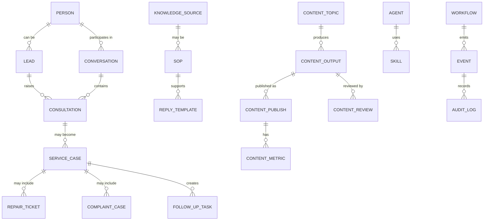

# Agent OS Domain Model

Updated: 2026-07-03

This document defines the shared business object language for Qintopia Agent OS. Product
docs, package manifests, workflow records, Feishu/Postgres schemas, tools, and
acceptance tests should use these terms consistently.

## Core Objects

| Object            | Meaning                                                      | Preferred store            |
| ----------------- | ------------------------------------------------------------ | -------------------------- |
| `Person`          | Human member, lead, employee, visitor, or partner            | Postgres/Feishu            |
| `Community`       | Qintopia or a sub-community/site                             | Postgres/Feishu            |
| `Lead`            | Potential customer/member before confirmed conversion        | Postgres/Feishu            |
| `Conversation`    | Message thread with channel and context                      | Postgres/Feishu            |
| `Consultation`    | Housing, community, SOP, or service inquiry                  | Postgres/Feishu            |
| `ServiceCase`     | Service process requiring owner, status, and resolution      | Postgres/Feishu            |
| `RepairTicket`    | Facility or repair issue                                     | Postgres/Feishu            |
| `ComplaintCase`   | Complaint or dissatisfaction case requiring careful handling | Postgres/Feishu            |
| `FollowUpTask`    | Concrete next action assigned to human or Agent              | Postgres/Feishu            |
| `SOP`             | Approved operating instruction                               | Feishu Docs/knowledge base |
| `ReplyTemplate`   | Approved reusable reply pattern                              | Postgres/Feishu            |
| `KnowledgeSource` | FAQ, SOP, document, policy, case, or content source          | Postgres/index             |
| `ContentTopic`    | Topic candidate for self-media or campaign content           | Postgres/Feishu            |
| `ContentOutput`   | Draft or approved content asset                              | Postgres/Feishu            |
| `ContentPublish`  | Publication record for a content output                      | Postgres/Feishu            |
| `ContentMetric`   | Performance metric from a content platform                   | Postgres/Feishu            |
| `ContentReview`   | Review result and next-action recommendation                 | Postgres/Feishu            |
| `Agent`           | Role-bounded AI worker                                       | Config/Postgres            |
| `Skill`           | Governed capability exposed to Agents                        | Package registry           |
| `Workflow`        | Multi-step process with state and ownership                  | Postgres/Feishu            |
| `Artifact`        | Generated or collected output with provenance                | Postgres/object store      |
| `Event`           | Normalized fact or trigger from channel, workflow, or system | Postgres/queue             |
| `AuditLog`        | Record of action, source, decision, approval, and output     | Postgres                   |

## Object Relationships

## Required Modeling Rules

- Use durable IDs for records that cross channels, tools, or review steps.
- Store source evidence and risk labels with the record that caused the action.
- Separate public-safe information from internal-only knowledge.
- Keep generated text separate from approved external delivery.
- Record human approval before high-risk external action.
- Prefer Postgres/Agent OS objects as the fact source; mirror to Feishu for human work.
