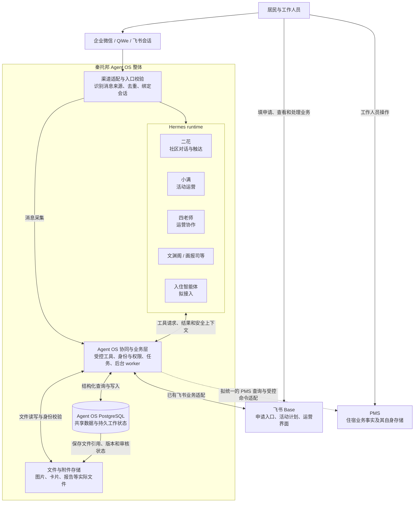
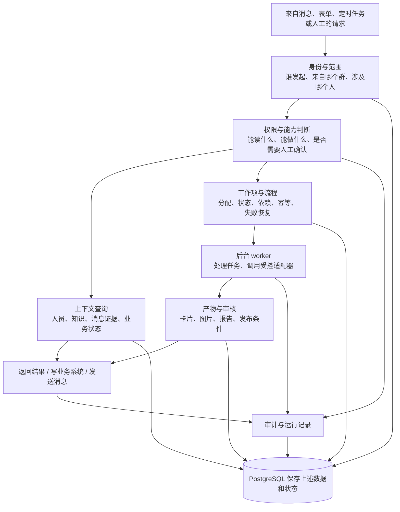
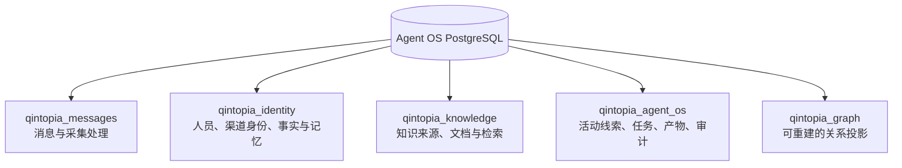
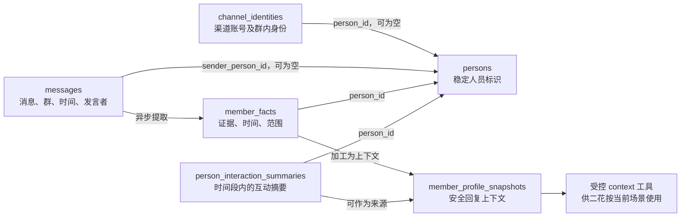
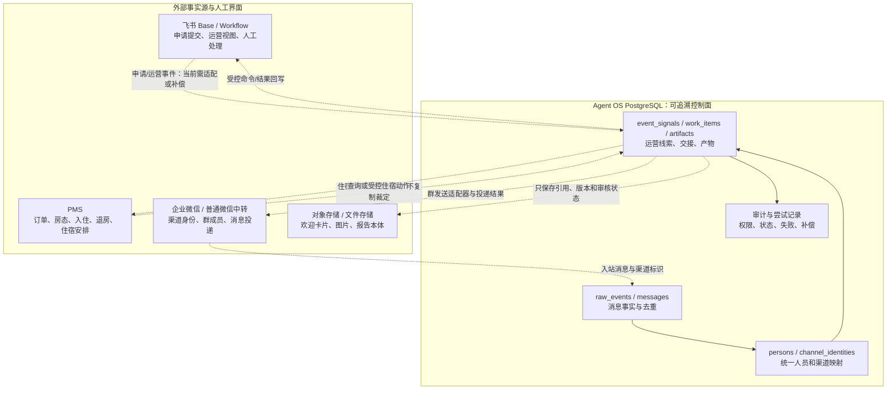
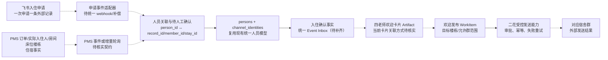
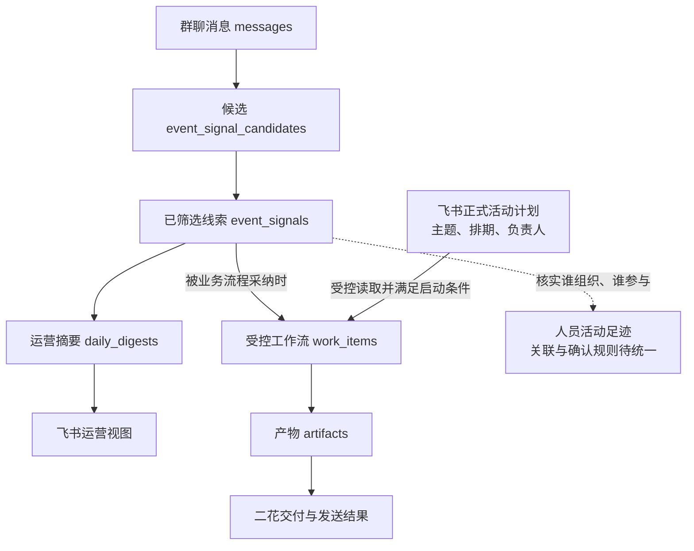
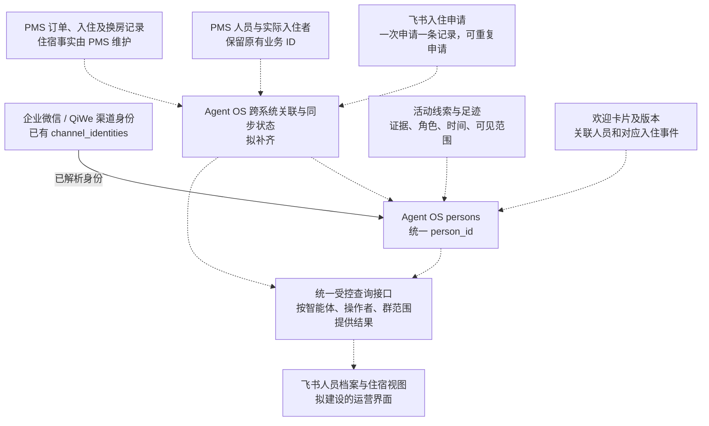

# 秦托邦 Agent OS：系统与数据关系图

日期：2026-09-08。用途：帮助理解系统结构、数据流和统一人员档案的建设位置，不是部署或改表指令。

本文根据当前仓库的架构、SQL 迁移和能力代码整理，未连接生产数据库统计记录数。文中的“已有”表示仓库已有结构或机制，不代表所有路径均已在线上启用。虚线表示拟建设或尚待打通的关联。

## 1. 先分清这几个名字

| 名称                  | 它是什么                                   | 负责什么                                               | 不负责什么                               |
| --------------------- | ------------------------------------------ | ------------------------------------------------------ | ---------------------------------------- |
| 秦托邦 Agent OS 整体  | 多智能体协作系统                           | 把智能体、数据、工具、人工操作和外部业务连接起来       | 不是一个大模型，也不是一张表             |
| Hermes runtime        | 智能体运行环境                             | 运行各个 profile、调用模型、维护会话、调用工具         | 不作为人员和住宿业务的权威数据库         |
| Agent OS 协同与业务层 | 我们维护的业务程序及契约                   | 身份解析、权限判断、任务流转、受控执行、同步、审计     | 不靠模型自由文本决定是否有权执行         |
| PostgreSQL            | 数据库软件                                 | 持久保存表、关联、任务状态、索引和审计；提供查询和事务 | 不会自己理解群聊、提炼活动或决定发欢迎卡 |
| 飞书 Base             | 人工填写和操作界面，也是部分业务数据的来源 | 接收入住申请、维护活动计划、展示档案及处理结果         | 不重复裁定 PMS 的入住、房态和收款事实    |
| PMS                   | 独立的住宿业务系统                         | 订单、房间和床位、入住、换房、退房、费用与收款事实     | 不承担全部社区聊天、活动和跨智能体记忆   |

“Agent
OS”有广义和狭义两种用法。广义指整个秦托邦智能体系统；下文框图里的“协同与业务层”特指我们编写的程序。Hermes 和 PostgreSQL 都是整体系统使用的组成部分。

## 2. 整个系统怎样连接

这是逻辑职责图，不是服务器或进程部署图。普通对话回复可以由 Hermes 渠道适配器直接返回；异步发布、图片发送等有各自的后台执行链，并非每句话都创建一个工作项。

目前已知四老师有独立的 PMS 只读接入；图中虚线表示它还需要纳入团队共用的身份、业务与权限契约。入住智能体的 PMS 写操作尚不能因此视为已上线。

## 3. Agent OS 内部有哪些功能

Agent OS 协同与业务层不是单独一个万能进程。实现分布在
`skills/`、`workflows/`、`mcp/`、`runtime/sidecar/`
等位置，由工具接口和后台任务共同工作。

| 功能         | 白话解释                                         | 主要现有承载                                         |
| ------------ | ------------------------------------------------ | ---------------------------------------------------- |
| 身份解析     | 把渠道账号对应到一个人，不靠昵称猜测             | `qintopia_identity`、身份 worker、context 工具       |
| 能力与权限   | 判断哪个智能体可以调用什么、请求是否满足业务条件 | `capabilities`、工具校验、会话策略、部署配置         |
| 任务协作     | 把“小满请二花发送”变成可追踪、可恢复的工作       | `work_items`、`work_item_events`、workflow 和 worker |
| 知识与上下文 | 在回答前提供本轮允许使用的证据和资料             | `qintopia_knowledge`、context MCP、检索工具          |
| 产物管理     | 记录谁生成了哪张图片、哪个版本、是否通过审核     | `artifacts`、审核与发送相关表、外部文件存储          |
| 数据加工     | 从消息形成候选线索、摘要、人员事实和检索索引     | 消息处理、画像、活动线索、摘要、图投影 worker        |
| 外部集成     | 通过明确接口访问飞书、QiWe、PMS 等               | 各适配器；PMS 的团队共用接入待统一                   |
| 审计恢复     | 记录执行原因、状态变化、失败、重复请求和发送结果 | 审计表、事件、尝试记录、同步状态                     |

现有权限机制主要围绕具体工具和工作流；社区负责人、舍长、宿舍记忆的完整层级授权仍是待补能力。数据库里有角色或权限字段，不等于业务权限已经完整执行。

## 4. PostgreSQL 内部怎样组织

可以按“数据库 → schema
→ 表 → 行 → 字段”理解。schema 是一组表的命名空间，不是另一台数据库服务器，也不自动构成数据权限边界。

例如：`qintopia_identity.persons` 表示 `qintopia_identity` 分区里的 `persons`
表。表里每一行对应一个人员记录，`id` 是它的标识，其他表可以用这个标识关联到它。

当前仓库迁移文件中，可识别到下列
**58 个不同的建表名称**。这是代码中的结构统计，不是线上表数量、记录数量或功能启用情况。

| Schema               | 仓库建表名称数 | 数据内容                                                                   |
| -------------------- | -------------: | -------------------------------------------------------------------------- |
| `qintopia_messages`  |             10 | 消息、会话、提及、原始事件、向量、处理任务及早期实体关系                   |
| `qintopia_identity`  |             11 | 人员、别名、渠道身份和观察、成员关系、事实、摘要、画像、训练记忆、读取审计 |
| `qintopia_knowledge` |              6 | 知识来源、文档、片段、向量、同步任务、访问审计                             |
| `qintopia_agent_os`  |             27 | 能力、工作项、产物、活动线索、日报、发布与审核状态、会话策略、审计等       |
| `qintopia_graph`     |              4 | 实体、来源观察、关系、投影进度                                             |

### 4.1 最值得认识的表

下表不是全部表，也不展开每个字段。

| 分区      | 表                                                               | 一行大致代表什么                       | 准备怎样使用                                               |
| --------- | ---------------------------------------------------------------- | -------------------------------------- | ---------------------------------------------------------- |
| messages  | `conversations`                                                  | 一个渠道会话                           | 定位群或会话范围                                           |
| messages  | `messages`                                                       | 一条标准化消息                         | 查询有权限的聊天证据、提取线索；可关联发言人的 `person_id` |
| messages  | `raw_events`                                                     | 一次采集入口事件                       | 去重、排障和受控回溯，不直接提供给二花回答                 |
| messages  | `message_mentions`                                               | 消息中的一次提及                       | 解析消息提到了谁                                           |
| messages  | `message_embeddings`                                             | 消息内容的一份向量索引                 | 语义检索；不是身份认证或人员匹配的权威依据                 |
| messages  | `message_processing_jobs`                                        | 一项消息加工任务                       | 异步处理与重试，不阻塞群消息接收                           |
| identity  | `persons`                                                        | 一个统一人员记录                       | 作为社区成员、申请人、住客等角色的共同人员标识基础         |
| identity  | `person_aliases` / `channel_identities`                          | 一个别名或渠道身份                     | 关联昵称、群内显示名和平台账号；身份未确定时可暂不绑定人员 |
| identity  | `person_memberships`                                             | 一个人的一种社区角色关系               | 表达成员角色和有效状态；完整宿舍授权需要进一步建设         |
| identity  | `member_facts`                                                   | 一条带来源的成员事实或信号             | 保存兴趣、沟通偏好等，附证据、时间、可见范围及撤销状态     |
| identity  | `person_interaction_summaries`                                   | 一个人在一个时间窗口内的互动摘要       | 查看特定时期的活动和交流线索                               |
| identity  | `member_profile_snapshots`                                       | 一版生成的回复上下文                   | 二花使用经过筛选的摘要，不直接读取全部档案                 |
| identity  | `erhua_training_notes` / `erhua_persona_overlays`                | 一条训练记录或风格规则                 | 支持受控训练；分宿舍隔离、完整撤回仍待完善                 |
| agent_os  | `event_signal_candidates` / `event_signals`                      | 一条候选或已筛选的运营事件线索         | 小满识别活动、服务需求、未解决问题，并保留来源证据         |
| agent_os  | `daily_digests`                                                  | 一个群、一天、指定负责智能体的运营摘要 | 汇总和发布运营信息；另有业务专用日报生成路径               |
| agent_os  | `capabilities`                                                   | 一个登记的业务能力                     | 表达提供者、允许调用者、输入输出和审核规则                 |
| agent_os  | `work_items` / `work_item_events`                                | 一项工作及其状态变化事件               | 跨智能体分工、恢复、追责                                   |
| agent_os  | `artifacts`                                                      | 一份工作产物及其身份、引用和状态       | 追踪图片、报告和未来欢迎卡片，避免只凭文件名查找           |
| agent_os  | `human_workbench_refs`                                           | 工作项对应的人工界面引用               | 把内部工作与飞书里的处理入口关联                           |
| knowledge | `knowledge_sources` / `knowledge_documents` / `knowledge_chunks` | 一个来源、一份文档、一个片段           | 为受控问答提供可追溯知识                                   |
| graph     | `graph_entities` / `graph_edges`                                 | 一个实体或一条有证据的关系             | 支持关系查询；从源数据重建，不另立人员或住宿事实主库       |

数据库还通过索引加速“某群某天的消息”“某人的事实”等查询，通过唯一约束防止部分重复写入，通过事务让相关状态一起提交。并非每条已有业务路径都已经具备完整幂等和事务保障，需要按实际实现验收。

### 4.2 消息与人员是怎样关联的

这张图混合展示数据引用与加工方向，箭头文字说明其含义，不是完整 SQL 外键图。消息来自同一个昵称，不代表已经确认是同一个人；消息存在，也不代表身份关联已经完成。

### 4.3 核心表的实际关系：先看外键，再看业务关联

下面这张图只选出最能解释主数据流的表。表名缩写对应

```mermaid
erDiagram
    RAW_EVENTS ||--o{ MESSAGES : "raw_event_id"
    CONVERSATIONS ||--o{ MESSAGES : "conversation_id"
    MESSAGES ||--o{ MESSAGE_MENTIONS : "message_id"
    MESSAGES ||--o{ MESSAGE_EMBEDDINGS : "message_id"
    MESSAGES ||--o{ MESSAGE_PROCESSING_JOBS : "message_id"
    MESSAGES ||--o{ MESSAGE_ENTITIES : "message_id"
    ENTITIES ||--o{ MESSAGE_ENTITIES : "entity_id"
    ENTITIES ||--o{ ENTITY_EDGES : "source/target_entity_id"
    MESSAGES ||--o{ ENTITY_EDGES : "evidence_message_id"

    PERSONS ||--o{ PERSON_ALIASES : "person_id"
    PERSONS ||--o{ CHANNEL_IDENTITIES : "person_id"
    PERSONS ||--o{ PERSON_MEMBERSHIPS : "person_id"
    PERSONS ||--o{ MEMBER_FACTS : "person_id"
    CHANNEL_IDENTITIES ||--o{ MEMBER_FACTS : "channel_identity_id"
    MESSAGES ||--o{ MEMBER_FACTS : "source_message_id"
    KNOWLEDGE_DOCUMENTS ||--o{ MEMBER_FACTS : "source_document_id"
    PERSONS ||--o{ PERSON_INTERACTION_SUMMARIES : "person_id"
    CHANNEL_IDENTITIES ||--o{ PERSON_INTERACTION_SUMMARIES : "channel_identity_id"
    PERSONS ||--o{ MEMBER_PROFILE_SNAPSHOTS : "person_id"
    PERSONS ||--o{ MEMBER_CONTEXT_AUDIT : "person_id"
    CHANNEL_IDENTITIES ||--o{ MESSAGES : "sender_channel_identity_id"
    PERSONS ||--o{ MESSAGES : "sender_person_id"

    KNOWLEDGE_SOURCES ||--o{ KNOWLEDGE_DOCUMENTS : "source_id"
    KNOWLEDGE_DOCUMENTS ||--o{ KNOWLEDGE_CHUNKS : "document_id"
    KNOWLEDGE_CHUNKS ||--o{ KNOWLEDGE_EMBEDDINGS : "chunk_id"
    KNOWLEDGE_SOURCES ||--o{ KNOWLEDGE_SYNC_JOBS : "source_id"
    KNOWLEDGE_DOCUMENTS ||--o{ KNOWLEDGE_SYNC_JOBS : "document_id"

    MESSAGES ||--o{ EVENT_SIGNAL_CANDIDATES : "source_message_id"
    CAPABILITIES ||--o{ WORK_ITEMS : "capability_key"
    EVENT_SIGNALS ||--o{ WORK_ITEMS : "source_event_signal_id"
    WORK_ITEMS ||--o{ WORK_ITEMS : "parent_work_item_id"
    WORK_ITEMS ||--o{ ARTIFACTS : "work_item_id"
    WORK_ITEMS ||--o{ WORK_ITEM_EVENTS : "work_item_id"
    ARTIFACTS ||--o{ WORK_ITEM_EVENTS : "artifact_id"
    WORK_ITEMS ||--o{ HUMAN_WORKBENCH_REFS : "work_item_id"
    ARTIFACTS ||--o{ HUMAN_WORKBENCH_REFS : "artifact_id"

    AGENT_CONTEXT_REQUESTS ||--o{ AGENT_CONTEXT_RESULTS : "request_id"
    CONVERSATION_POLICIES ||--o{ CONVERSATION_POLICY_ACTORS : "policy_id"
    WORK_ITEMS ||--o{ POSTER_WORKFLOW_PARTICIPANTS : "workflow_root_id"
    CONVERSATION_POLICIES ||--o{ POSTER_WORKFLOW_PARTICIPANTS : "policy_id"
```

`qintopia_<schema>.<table>`；连线表示迁移文件中已经声明的 PostgreSQL 外键。它不是 58 张表的完整清单，而是读懂现状的主干。

读这张图时要区分三种关系：

| 关系类型                 | 在仓库中的表现                             | 例子                                                                           | 结论                                                       |
| ------------------------ | ------------------------------------------ | ------------------------------------------------------------------------------ | ---------------------------------------------------------- |
| 真实数据库外键           | `REFERENCES ...`，数据库可以约束目标行     | `messages.raw_event_id → raw_events.id`                                        | 可以按数据库约束理解删除、孤儿行和基数                     |
| 数组或 JSON 中的业务引用 | 字段里保存 ID 数组、哈希或 JSON，未必有 FK | `event_signals.source_message_ids`、`member_profile_snapshots.source_fact_ids` | 业务上有关联，但数据库不会替你校验目标是否存在             |
| 外部系统映射             | 外部 ID 在适配器字段或元数据中保存         | PMS `member_id`、飞书 `record_id`、QiWe `senderId`                             | 不是当前 PostgreSQL 内建外键，必须靠适配器、幂等和审计维护 |

当前尤其要注意：`event_signal_candidates` 有到 `messages` 的外键，但 `event_signals`
对候选和来源消息主要使用数组； `persons`
与 PMS/飞书申请之间也还没有本地外键。这解释了为什么“统一人员档案”和“入住欢迎闭环”不能只靠查询现有
`persons` 表就完成。

### 4.4 现状数据流：一条消息怎样变成受控协作

这是仓库中证据最完整的主路径，重点体现数据如何从采集事实逐步变成 Agent 可执行的协作任务。实线表示已有仓库结构或代码路径；虚线表示外部边界或尚待统一的接入。

```mermaid
flowchart LR
    QIWE["QiWe / 企业微信中转<br/>入站事件"] -.-> ADAPTER["渠道适配器<br/>解析、去重、触发判断"]
    ADAPTER --> RAW["qintopia_messages.raw_events<br/>原始事件去重记录"]
    RAW --> MSG["qintopia_messages.messages<br/>标准化消息"]

    MSG --> CI["qintopia_identity.channel_identities<br/>平台身份、chat_id、sender_id"]
    CI --> PERSON["qintopia_identity.persons<br/>稳定 person_id"]
    MSG -->|"sender_channel_identity_id / sender_person_id"| PERSON
    PERSON --> FACT["member_facts / interaction_summaries<br/>带证据的事实与摘要"]
    FACT --> SNAP["member_profile_snapshots<br/>安全回复上下文"]
    SNAP --> CTX["Context MCP / 受控工具<br/>按 caller、群和用途裁剪"]
    CTX --> HERMES["Hermes Agent runtime<br/>二花 / 小满等"]
    HERMES --> REPLY["内部回复或受控能力请求"]

    MSG --> CAND["event_signal_candidates<br/>消息加工候选"]
    CAND --> SIGNAL["event_signals<br/>筛选后的运营线索"]
    SIGNAL --> CAP["capabilities<br/>能力注册与调用边界"]
    CAP --> WI["work_items<br/>可追踪的协作工作"]
    WI --> WIE["work_item_events<br/>状态、结果、阻塞、接管"]
    WI --> ART["artifacts<br/>图片、报告、卡片等产物引用"]
    ART --> SEND["QiWe / Feishu 受控发送适配器<br/>外部发送与结果审计"]
    SEND --> AUDIT["审计、尝试与补偿状态"]

    classDef fact fill:#e8f3ff,stroke:#3678b8,color:#123;
    classDef control fill:#fff3d6,stroke:#b87900,color:#432;
    classDef runtime fill:#e9f7ed,stroke:#3a8f5b,color:#132;
    class RAW,MSG,CI,PERSON,FACT,SNAP,CAND,SIGNAL fact;
    class CAP,WI,WIE,ART,AUDIT control;
    class CTX,HERMES,REPLY,SEND runtime;
```

这条主路径有三个重要边界：

1. `senderId` 首先是中转消息里的渠道标识，只有在 `channel_identities.person_id`
   已确认后，才可以通过受控 context 工具取得这个 `person_id`
   的安全背景；它不能跳过身份确认直接读取人员资料。
2. Hermes 负责运行 Agent 和调用能力，`work_items`
   负责保存跨 Agent 的工作状态。模型的一次回复不等于一个 WorkItem，只有需要异步交接、重试、人工接管或外部发送的动作才应进入工作项。
3. `artifacts`
   保存产物的身份、来源和状态，图片或文件本体仍在对象存储/外部文件系统；数据库不是把二进制内容全部塞进工作项。

### 4.5 外部事实源与本地控制面的分界

| 系统              | 当前应视为权威的内容                                   | Agent OS 当前保存/使用方式                                  | 不应推断的内容                                        |
| ----------------- | ------------------------------------------------------ | ----------------------------------------------------------- | ----------------------------------------------------- |
| PMS               | 订单、房态、入住、退房、换房和住宿安排                 | 目前是外部业务事实源；统一住客映射仍需接入契约              | 不能因为已有 `persons` 就认为 PMS 已经同步            |
| 飞书 Base         | 申请提交和工作人员熟悉的操作界面；活动运营字段仍有使用 | 通过受控 Base skill/workflow 读写或展示                     | Base 单表不是事件 Inbox，也不是跨 Agent 身份主库      |
| QiWe/企业微信中转 | 渠道用户/群标识、入站消息和发送结果                    | `raw_events`、`messages`、`channel_identities` 及适配器审计 | `senderId` 不能直接当作官方 `external_userid`         |
| Agent OS/Postgres | 统一身份、跨系统关联、事件、工作项、产物和审计         | 多 schema 表、FK、唯一约束、状态机和审计                    | 它不取代 PMS 的住宿事实，也不自动拥有所有外部系统权限 |
| 对象存储          | 卡片、图片、报告等文件本体                             | `artifacts` 保存引用、版本、哈希/状态和工作项关联           | 仅凭文件名无法可靠关联住客或工作                      |

### 4.6 入住欢迎闭环在当前数据图中的位置

这个闭环是目标业务，但从当前仓库能直接证明的主要是“人员、消息、能力、WorkItem、Artifact、发送控制面”这些基础件。飞书入住申请、PMS 住客/住宿事实、四老师卡片和楼栋群目标之间的统一关联，在现有迁移中还没有一组已经落地的本地表和外键。因此应把它画成“外部事实进入控制面后的待接入路径”：

所以当前最准确的理解是：**Agent
OS 已经有可承载统一身份和协作控制面的数据库骨架，但入住欢迎链路的外部事实映射还不是现成的完整表关系。**
这也是后续设计要先定义 `Application`、`PMSMemberLink`、`Stay`、`Artifact` 与统一
`Event/WorkItem` 关联契约的原因。

## 5. 聊天记录、活动记录究竟是什么关系

“活动数据在 PostgreSQL”需要拆开看：

| 数据层                 | 例子                                   | 当前组织方式                                                  |
| ---------------------- | -------------------------------------- | ------------------------------------------------------------- |
| 聊天证据               | 某人在群里说“周六想组织跑步”           | `messages`                                                    |
| 候选线索               | 这条消息可能是一次活动组织意向         | `event_signal_candidates`                                     |
| 已筛选的运营线索       | 汇总几条相关消息，形成待跟进的活动线索 | `event_signals`                                               |
| 正式活动计划和运营字段 | 已确认主题、日期、负责人、排期等       | 当前还有飞书活动表及小满受控读写路径，不能一概视为全部迁入 PG |
| 执行过程和结果         | 生成海报、审核、交给二花发送           | `work_items`、`artifacts`、事件与发送状态                     |
| 人员活动足迹           | 某人组织或参与了某次活动               | 已有成员事实和摘要基础；统一、可靠的参与关系仍需核实和补齐    |

多个消息可以汇总成一个事件，一条消息也可能产生多个候选。当前事件表有
`related_member_names` 和来源消息引用；这不等于已建立完整的“人员 ID × 活动 ID
× 参与角色”关系。不能把提到活动自动认定为实际参加。

## 6. 统一人员档案准备补在哪一层

下面是目标关系，虚线是需要补齐或验证的部分，节点名称不是已经定稿的新表名。

这里的“统一”是统一标识、关系和访问契约，不是把 PMS、飞书、群聊原文复制进一张万能表。

- 一个 `person_id` 可以关联多条申请、多次住宿、多个渠道身份和多次活动。
- 一个订单可能涉及订房人、会员和多名实际入住人，必须区分角色。
- 飞书 `record_id`
  是申请或档案记录的标识；PMS 订单 ID 是订单标识；它们都不直接取代统一人员 ID。
- 手机号和昵称可帮助匹配，但不是永不变化的唯一主键；误绑定需要能撤销。
- PMS 的状态变化同步成关联视图。入住智能体必须先取得 PMS 成功结果，再反映到档案，不能先把档案标为“已入住”。
- 联系方式、当前显示名等档案字段应明确来源和修改入口；不能让飞书与 PostgreSQL 无规则地互相覆盖。
- 卡片正文和图片可保存在专门文件存储；档案关联的是产物身份、版本、审核状态及引用。
- 身份可以跨群统一，记忆和内容可见范围不能因此自动跨群共享。

### 6.1 同一套数据怎样服务不同智能体

| 智能体               | 通过共用接口取得什么                                           | 产生什么                                |
| -------------------- | -------------------------------------------------------------- | --------------------------------------- |
| 二花                 | 当前说话人的安全上下文；欢迎对象、当前楼栋、可发送卡片及目标群 | 对话回复、欢迎分发请求与结果            |
| 小满                 | 允许范围内的活动计划、事件线索和经确认的参与关系               | 活动运营任务、内容及协作请求            |
| 四老师               | 获准展示的人员概要、申请资料、运营上下文                       | 欢迎卡片、运营材料和协作结果            |
| 入住智能体（拟接入） | 申请、人员关联、PMS 当前房源和订单状态、操作人员授权           | 受控 PMS 命令；成功结果驱动档案视图更新 |

数据库连接权、智能体读取权、操作者业务权是不同层次。后台能连接数据库，不代表模型可以执行任意 SQL 或看见全部人员信息。

## 7. 哪些已有，哪些仍待建设

| 层面         | 当前仓库基础                                   | 不能据此推断已完成的部分                            |
| ------------ | ---------------------------------------------- | --------------------------------------------------- |
| 人员身份     | Person、别名、渠道身份、成员关系               | 所有人员去重正确；企微、飞书和 PMS 已全部对齐       |
| 消息与记忆   | 消息采集、处理任务、事实、摘要、画像、训练记录 | 全量消息均已加工；宿舍记忆已隔离；训练撤回已完整    |
| 活动运营     | 候选、事件、摘要、飞书活动工具、执行工作流     | 所有活动已形成统一台账；每个参与人均已可靠绑定      |
| 多智能体协作 | 能力注册、工作项、产物、审核和发送链           | 所有智能体都已通过同一入口协作；每种业务都已上线    |
| 统一住客档案 | 现有 Person 可以作为建设起点                   | PMS/申请/卡片关联、同步与纠错、运营档案界面尚待统一 |

这份文件没有统计生产库中的人员数、消息数、活动数、数据时间范围或关联覆盖率。回答这些问题需要另做生产只读盘点；仓库中的 58 个建表名称不能代替这类证据。

## 8. 依据与继续阅读

以下是本次核对的本地来源。较早设计文档中的上线进度描述只作历史背景；表名和结构优先对照迁移与现有代码。

- [整体架构](../../../docs/architecture/agent-os-overview.md)
- [Agent OS 数据分区与身份设计](../../../runtime/postgres/docs/data-design/2026-06-24-agent-os-data-layer-v2.md)
- [人员与知识等结构迁移](../../../runtime/postgres/migrations/202606240002_agent_os_data_layer.sql)
- [消息结构迁移](../../../runtime/postgres/migrations/202606180001_init.sql)
- [活动线索结构迁移](../../../runtime/postgres/migrations/202606270005_event_signals_v2.sql)
- [多智能体协作表结构](../../../runtime/postgres/migrations/202606300007_operations_control_plane.sql)
- [小满活动能力](../../../skills/xiaoman-activity/README.md)
- 入住智能体集成方案：外部 Green PMS 讨论材料，未收录于本仓库。

本文包含 10 张 Mermaid 图。在支持 Mermaid 的 Markdown 阅读器中可以直接显示；不支持时会看到对应的图形源码。
