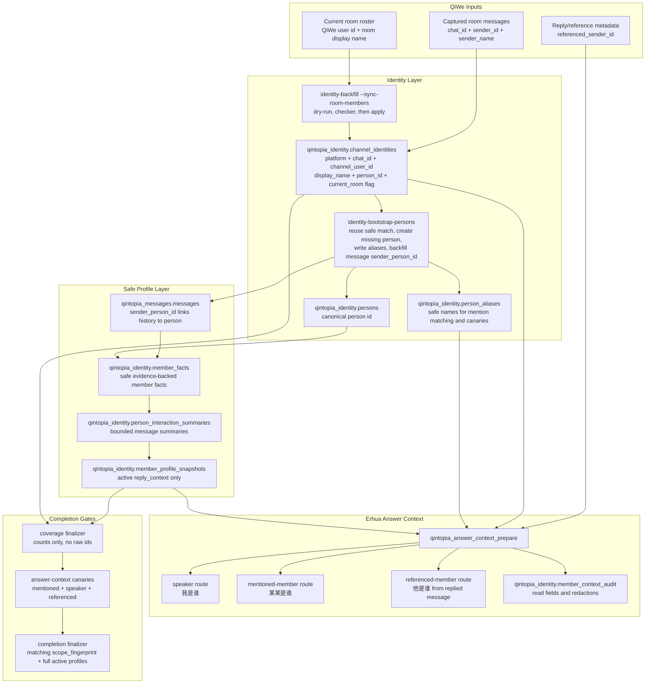

# Erhua Member Recognition Production Runbook

This runbook verifies and repairs Erhua member recognition coverage after a reviewed
release containing the identity/profile changes is published. It must not copy raw chat
logs, raw member profile text, QiWe user ids, group ids, or database URLs into git.

## Goal

Erhua can answer "who is this member" only when these boundaries are true:

- the current QiWe room member roster has been synced into
  `qintopia_identity.channel_identities`;
- every current-room QiWe `channel_identities` row that can be safely linked has a
  `person_id`;
- every linked QiWe display name is present in `person_aliases`;
- linked historical messages have `sender_person_id`;
- linked people have active `reply_context` profile snapshots when there is enough
  message evidence;
- every linked current-room person has a materialized QiWe platform identity so speaker
  questions such as "我是谁" can resolve without retaining raw `sender_id` values in
  evidence;
- reply/reference questions such as "他是谁" resolve only when the channel adapter
  passes the replied-to sender as `referenced_sender_id`; without that field Erhua asks
  which member is meant instead of guessing from recent messages;
- concrete repeated signals such as running activities remain visible in safe profile
  hints instead of being collapsed only into a generic activity topic.

## Recognition Flow

All production repair and evidence steps must use the same reviewed Erhua QiWe group id:
`QINTOPIA_PROFILE_TARGET_CHAT_IDS` and
`QINTOPIA_ERHUA_MEMBER_RECOGNITION_CANARY_CHAT_ID` must point at that same group. The
canary sender id is used only to exercise answer-context routes and must stay
server-local.



The graph has two intentional choke points. `channel_identities.person_id` is the
identity choke point: without it, Erhua cannot safely map a QiWe sender to a person.
`member_profile_snapshots(status='active', profile_kind='reply_context')` is the profile
choke point: without it, Erhua may recognize the identity but must not infer a stable
profile. Completion is claimed only after the count-only coverage and answer-context
canaries prove both choke points for the same current-room scope.

## Sequence

Run the release-local sidecar from `release/current`; do not hot-edit server files.

0. Apply the reviewed persistent Erhua member-recognition config. This binds
   `QINTOPIA_PROFILE_TARGET_CHAT_IDS` and
   `QINTOPIA_ERHUA_MEMBER_RECOGNITION_CANARY_CHAT_ID` to the same reviewed group and
   stores the reviewed canary sender id for answer-context canaries. The script does not
   call QiWe, run SQL, or repair identities.

   ```bash
   QINTOPIA_ERHUA_MEMBER_RECOGNITION_PRODUCTION_CONFIG=approved-production-erhua-member-recognition-config \
   QINTOPIA_ERHUA_MEMBER_RECOGNITION_CONFIG_CHAT_ID=<reviewed-erhua-qiwe-group-id> \
   QINTOPIA_ERHUA_MEMBER_RECOGNITION_CONFIG_CANARY_SENDER_ID=<reviewed-erhua-canary-sender-id> \
     deploy/sidecar/scripts/apply-erhua-member-recognition-production-config.sh --apply
   ```

   If the persistent env already has exactly one `QINTOPIA_PROFILE_TARGET_CHAT_IDS`, the
   chat-id override may be omitted; the canary sender id is still required unless it is
   already present from a prior reviewed config apply. The persistent env file must be a
   regular non-symlink file that is not group/world writable, and the reviewed canary
   sender id must differ from the reviewed group id. Do not paste the real group id or
   sender id into retained evidence, issues, or chat.

   Then run the read-only config observation. It prints only sanitized booleans, counts,
   and `scope_fingerprint`; it does not print the real group id, sender id, or database
   URL and does not call QiWe, Postgres, MCP, systemctl, or the network.

   ```bash
   QINTOPIA_ERHUA_MEMBER_RECOGNITION_CONFIG_OBSERVATION_ENABLE=1 \
     deploy/sidecar/scripts/erhua-member-recognition-production-config-observation-smoke.sh
   ```

   Continue only when the observation reports
   `action_status=ready_for_member_recognition_runbook`,
   `profile_target_matches_canary_chat=true`, and
   `canary_sender_differs_from_chat=true`.

1. Sync the current reviewed Erhua QiWe room roster into `channel_identities`. This step
   does not create people or profiles; it only makes current group membership visible to
   the following identity bootstrap. Applied sync marks current roster identities with
   `current_qiwe_room_member=true` and marks same-room historical identities that are no
   longer in the roster as stale metadata; it does not delete rows or unlink people.

   ```bash
   qintopia-message-sidecar identity-backfill \
     --sync-room-members \
     --chat-id "${QINTOPIA_ERHUA_MEMBER_RECOGNITION_CANARY_CHAT_ID}" \
     --dry-run \
     > /tmp/erhua-room-member-sync-dry-run.json

   node tools/deploy/check-erhua-room-member-sync.mjs \
     /tmp/erhua-room-member-sync-dry-run.json

   qintopia-message-sidecar identity-backfill \
     --sync-room-members \
     --chat-id "${QINTOPIA_ERHUA_MEMBER_RECOGNITION_CANARY_CHAT_ID}" \
     --apply \
     > /tmp/erhua-room-member-sync-apply.json

   node tools/deploy/check-erhua-room-member-sync.mjs \
     /tmp/erhua-room-member-sync-apply.json
   ```

   Retain only the checker output and the sanitized count report, including
   `scope_fingerprint` and `stale_room_member_identities_marked`. Do not copy the real
   group id, QiWe user ids, database URL, token, or raw room-detail payload into git or
   chat.

2. Capture a dry-run coverage report:

   ```bash
   qintopia-message-sidecar identity-bootstrap-persons \
     --chat-id "${QINTOPIA_ERHUA_MEMBER_RECOGNITION_CANARY_CHAT_ID}" \
     --dry-run \
     > /tmp/erhua-identity-bootstrap-dry-run.json
   ```

3. Validate the report locally or on the server without exposing secrets:

   ```bash
   node tools/deploy/finalize-erhua-member-recognition-coverage.mjs \
     --coverage /tmp/erhua-identity-bootstrap-dry-run.json \
     --summary-output /tmp/erhua-member-recognition-coverage-summary.json
   ```

   A failure on `identity bootstrap apply is still required` is expected before the
   repair apply. The coverage finalizer still validates the sanitized count-only summary
   when the coverage checker fails, and that summary may be retained to show which layer
   is still incomplete. A failure on ambiguous identities means stop and prepare a
   reviewed manual merge list. The finalizer invokes
   `node tools/deploy/check-erhua-member-recognition-coverage-summary.mjs` internally;
   use the same checker to revalidate retained sanitized count-only evidence later.

4. After owner approval, apply the identity repair:

   ```bash
   qintopia-message-sidecar identity-bootstrap-persons \
     --chat-id "${QINTOPIA_ERHUA_MEMBER_RECOGNITION_CANARY_CHAT_ID}" \
     --apply
   ```

   The apply may create previously unseen people, reuse a single existing QiWe user
   mapping, reuse a unique exact display-name/alias match, materialize platform-level
   QiWe identities, write aliases, and backfill `sender_person_id`. It must skip
   ambiguous matches.

5. Refresh safe member profiles:

   ```bash
   qintopia-message-sidecar member-profile \
     --chat-id "${QINTOPIA_ERHUA_MEMBER_RECOGNITION_CANARY_CHAT_ID}" \
     --limit 5000 \
     --apply \
     --quiet \
     > /tmp/erhua-member-profile-apply.json
   ```

   Use the larger one-shot `--limit 5000` window for member-recognition repair so older
   self-introductions, interests, and recurring activity signals are considered. The
   quiet profile report must emit `requested_message_limit >= 5000` and exactly one
   `scope_fingerprints` entry; retain that sanitized fingerprint with the count report,
   not the raw group id or raw candidate facts. If the final coverage report claims any
   active reply-context profiles, this same applied profile evidence must have
   `valuable_messages > 0`; otherwise the completion gate treats the profile claim as
   stale or wrong-scope evidence. An idempotent rerun may insert zero new snapshots when
   the existing active snapshot already has the same input hash.

6. Re-run the same-scoped dry-run and checker:

   ```bash
   qintopia-message-sidecar identity-bootstrap-persons \
     --chat-id "${QINTOPIA_ERHUA_MEMBER_RECOGNITION_CANARY_CHAT_ID}" \
     --dry-run \
     > /tmp/erhua-identity-bootstrap-dry-run.json

   node tools/deploy/finalize-erhua-member-recognition-coverage.mjs \
     --coverage /tmp/erhua-identity-bootstrap-dry-run.json \
     --require-active-profiles \
     --expect-pass \
     --summary-output /tmp/erhua-member-recognition-coverage-summary.json
   ```

   The post-apply dry-run also emits `answer_context_canary_specs`, which is the
   current-room linked-member canary spec for the answer-context gate. It also emits
   `answer_context_speaker_canary_specs` and `answer_context_referenced_canary_specs`
   for speaker self-recognition and reply/reference recognition. The same
   `scope_fingerprint` appears as the room-sync report when both commands use the same
   reviewed group id. The coverage checker requires all three canary spec arrays to be
   present and to match their total and unique-person counts, because the canary builder
   must run the exact current-room spec rather than a stale or hand-written list. The
   recognition gate is not green until:

   - `total_channel_identities = 0`, except ambiguous samples that require reviewed
     merge handling;
   - `qiwe_room_channel_identities_raw_total` equals the applied room-sync
     `room_members_discovered`;
   - `qiwe_room_channel_identities_linked = qiwe_room_channel_identities_total`;
   - `qiwe_room_potential_member_identities_unlinked = 0`;
   - retained completion `unsafe_display_unlinked = 0`;
   - `linked_aliases_missing = 0`;
   - `linked_messages_missing_sender_person = 0`;
   - `qiwe_platform_identities_missing = 0`;
   - `linked_people_without_qiwe_platform_identity = 0`;
   - `linked_people_without_answer_context_canary_spec = 0`;
   - `linked_people_without_active_profile = 0`;
   - `running_people_profile_missing_running_hint = 0`.

   A failure on `linked_people_without_answer_context_canary_spec` means at least one
   linked person has no safe non-numeric display name or alias to test, including names
   that contain phone-like digit runs, numeric-only labels, or system/test display text.
   Add a reviewed safe alias before claiming full member recognition coverage. Use the
   redacted `person_key` from
   `linked_people_without_answer_context_canary_spec_samples`; do not use QiWe
   `channel_user_id`, `chat_id`, raw messages, raw profile text, or database URLs in the
   payload.

   A failure on `qiwe_room_potential_member_identities_unlinked` means the current QiWe
   roster still contains a potential human member identity without a linked `person`.
   Build a reviewed safe-identity payload from the redacted `identity_key` samples, let
   the owner fill only a human-readable safe name, then apply it through the
   release-local sidecar. Do not include raw display names, QiWe user ids, chat ids,
   sender ids, raw messages, raw profile text, or database URLs.

   The finalized completion summary must also keep `unsafe_display_unlinked = 0`. This
   count is derived from potential-member gaps that are not normal safe bootstrap
   candidates, so numeric or otherwise unsafe display names cannot be hidden by the
   `excluded` current-room identity count.

   ```bash
   node tools/deploy/build-erhua-member-safe-identity-payload-template.mjs \
     --coverage /tmp/erhua-identity-bootstrap-dry-run.json \
     --output /tmp/erhua-member-safe-identity-template.json

   # Owner fills each blank safe_display_name, optionally adds person_key only when
   # the identity should be linked to an already-reviewed person, then saves:
   # /tmp/erhua-member-safe-identity.json

   node tools/deploy/check-erhua-member-safe-identity-payload.mjs \
     /tmp/erhua-member-safe-identity.json

   qintopia-message-sidecar erhua-member-safe-identity \
     --payload-file /tmp/erhua-member-safe-identity.json

   QINTOPIA_ERHUA_MEMBER_SAFE_IDENTITY_APPROVAL=approved-production-erhua-member-safe-identity \
     qintopia-message-sidecar erhua-member-safe-identity \
       --payload-file /tmp/erhua-member-safe-identity.json \
       --apply
   ```

   Payload format:

   ```json
   {
     "identities": [
       {
         "identity_key": "<12-32 char md5 identity key from sanitized evidence>",
         "safe_display_name": "<reviewed human-readable safe name>",
         "person_key": null,
         "reason": "owner reviewed current-room member identity for recognition coverage"
       }
     ]
   }
   ```

   ```bash
   node tools/deploy/build-erhua-member-safe-alias-payload-template.mjs \
     --coverage /tmp/erhua-identity-bootstrap-dry-run.json \
     --output /tmp/erhua-member-safe-alias-template.json

   # Owner fills each blank alias in the generated template, then saves:
   # /tmp/erhua-member-safe-alias.json

   node tools/deploy/check-erhua-member-safe-alias-payload.mjs \
     /tmp/erhua-member-safe-alias.json

   qintopia-message-sidecar erhua-member-safe-alias \
     --payload-file /tmp/erhua-member-safe-alias.json

   QINTOPIA_ERHUA_MEMBER_SAFE_ALIAS_APPROVAL=approved-production-erhua-member-safe-alias \
     qintopia-message-sidecar erhua-member-safe-alias \
       --payload-file /tmp/erhua-member-safe-alias.json \
       --apply
   ```

   Payload format:

   ```json
   {
     "aliases": [
       {
         "person_key": "<12-32 char md5 person key from sanitized evidence>",
         "alias": "<reviewed human-readable safe alias>",
         "source_display_name": "000",
         "reason": "owner reviewed safe member name for answer-context canary coverage"
       }
     ]
   }
   ```

   The command rejects missing approval on apply, unsafe aliases, numeric-only aliases,
   phone-like digit runs, system/test names, ambiguous `person_key` prefixes, people not
   linked to safe QiWe identities, and aliases that already resolve to another person.

   A failure on `qiwe_room_potential_member_identities_unlinked` means a current-room
   non-bot, non-system identity is still not linked to any person. This includes real
   members whose QiWe display name is unsafe for automatic handling, such as phone-like
   digit runs or control characters. Treat those as real people until reviewed
   otherwise: resolve them through an owner-reviewed identity merge/create path, then
   add a safe alias if they still have no safe canary name. Retain only the redacted
   `display_name` and short `identity_key` sample; do not retain raw QiWe user ids.

   A warning on `linked_people_without_active_profile` means Erhua may still recognize
   the member through identity-only context, but it must answer that there is no stable
   safe profile yet instead of inferring interests, preferences, or background.

   In same-chat mode, bootstrap coverage counts only identities marked
   `current_qiwe_room_member=true` by the latest room roster sync; historical rows
   marked stale are retained for audit and cross-chat history but do not enter the
   current-room denominator. `qiwe_channel_identities_excluded` records bot/system/test
   identities and display names that contain phone-like digit runs or control
   characters. They are excluded from automatic person creation and retained canary
   evidence; do not treat them as unresolved real members unless a reviewed safe alias
   is added first. `qiwe_channel_identities_raw_total` is the room-scoped raw QiWe
   identity count; `qiwe_channel_identities_total` is the room-scoped safe-processable
   subset, so raw must equal safe plus excluded. `chat_id=''` platform identities are
   checked through the separate `qiwe_platform_*` and
   `linked_people_without_qiwe_platform_identity` fields, not included in the
   current-room person denominator. The two coverage fields that feed reviewed repair
   payloads, `qiwe_room_potential_member_identities_unlinked_samples` and
   `linked_people_without_answer_context_canary_spec_samples`, must contain the complete
   current-room candidate set for the corresponding count. If a payload template says it
   would cover only part of the count, do not review or apply that partial payload.

7. Run answer-context canaries for every record in `answer_context_canary_specs`,
   `answer_context_speaker_canary_specs`, and `answer_context_referenced_canary_specs`.
   The mentioned-member spec includes linked QiWe display names, person aliases, and
   person display names. It should include known names and aliases such as `小乔`,
   `Paxon`, `Cici`, `园园老爹`, `HL`, `Brave`, and `萌哥`. The speaker self-canary spec
   is one record per current-room linked person and verifies messages like "我是谁"
   through the `speaker` answer-context path. The referenced-member spec is one record
   per current-room linked person and verifies pronoun-only reply/reference questions
   like "他是谁" through sanitized `referenced_member` output.

   Pronoun-only questions such as "他是谁" are adapter-reference cases, not
   mentioned-member canaries: the adapter must pass `referenced_sender_id` from the
   replied-to message, and Erhua must clarify when that reference is missing.

   The canary result should resolve each non-ambiguous name to a person and return only
   safe summary/profile hints, not raw messages or hidden profile details. Each retained
   canary record must include a returned `mentioned_members[].mention_text` exactly
   matching the `expected_mention`, with `resolution_status = resolved` and
   `match_count = 1`; a merely similar display name or non-unique match is not enough.
   Each retained speaker self-canary record must include `speaker.resolved = true`, a
   valid `speaker.person_ref`, and safe summary/profile hints. Retained canary records
   for referenced-member records must include `referenced_member.resolved = true`, a
   valid `referenced_member.person_ref`, and safe summary/profile hints. `person_ref` is
   an irreversible SHA-256 marker derived by the evidence builder only to prove that
   mentioned-member, speaker, and referenced routes resolved the same person inside the
   same retained evidence file; it is not a database UUID and must not be used as an
   operational identifier. Raw answer-context MCP output may contain `person_id` while
   it remains on the server, but retained canary JSONL must not contain `person_id`.
   Retained canary records must exactly match the `expected_mention` /
   `expected_speaker_label` / `expected_referenced_label`, `canonical_key`, and
   `required_profile_terms` emitted by the same coverage report, so a hand-written or
   stale canary list cannot replace the current-room bootstrap spec. The canary MCP
   input builder and evidence builder also reject coverage JSON whose canary spec arrays
   do not match their `*_total` and unique-person counts; do not delete "extra" names
   from the coverage output to make a shorter canary run. Mentioned-member, speaker
   self-canary, and referenced-member specs, plus their retained resolved evidence, must
   cover the same canonical people; equal counts alone are not enough. Duplicate canary
   spec ids or duplicate MCP answer-context response ids are invalid evidence because
   they could otherwise overwrite earlier JSONL results. The private sender map used to
   run speaker and referenced canaries contains raw QiWe `sender_id` values; keep it
   only as a server-local `/tmp` file and do not retain it as evidence. The MCP input
   builder compares the private sender map `scope_fingerprint` with the coverage report
   `scope_fingerprint` and requires the sender-map canonical keys to exactly match the
   speaker/referenced canary canonical people; a wrong-room, incomplete, or extra sender
   map must fail before raw MCP input is emitted.

8. Store the sanitized canary results as JSONL and validate them:

   ```bash
   qintopia-message-sidecar erhua-member-speaker-canary-sender-map \
     --chat-id "${QINTOPIA_ERHUA_MEMBER_RECOGNITION_CANARY_CHAT_ID}" \
     > /tmp/erhua-member-speaker-sender-map.private.json

   chmod 0600 /tmp/erhua-member-speaker-sender-map.private.json

   node tools/deploy/build-erhua-member-recognition-canary-mcp-input.mjs \
     --spec /tmp/erhua-identity-bootstrap-dry-run.json \
     --chat-id-env QINTOPIA_ERHUA_MEMBER_RECOGNITION_CANARY_CHAT_ID \
     --sender-id-env QINTOPIA_ERHUA_MEMBER_RECOGNITION_CANARY_SENDER_ID \
     --speaker-sender-map /tmp/erhua-member-speaker-sender-map.private.json \
     --output /tmp/erhua-member-recognition-context-mcp-input.jsonl

   /home/ubuntu/qintopia-agent-os-releases/current/deploy/sidecar/scripts/hermes/qintopia-context-mcp \
     < /tmp/erhua-member-recognition-context-mcp-input.jsonl \
     > /tmp/erhua-member-recognition-context-mcp.jsonl

   node tools/deploy/build-erhua-member-recognition-canary-evidence.mjs \
     --spec /tmp/erhua-identity-bootstrap-dry-run.json \
     --mcp-output /tmp/erhua-member-recognition-context-mcp.jsonl \
     --output /tmp/erhua-member-recognition-canary.jsonl

   node tools/deploy/check-erhua-member-recognition-canary.mjs \
     /tmp/erhua-member-recognition-canary.jsonl

   node tools/deploy/finalize-erhua-member-recognition-completion.mjs \
     --room-sync /tmp/erhua-room-member-sync-apply.json \
     --profile /tmp/erhua-member-profile-apply.json \
     --coverage /tmp/erhua-identity-bootstrap-dry-run.json \
     --canary /tmp/erhua-member-recognition-canary.jsonl \
     --summary-output /tmp/erhua-member-recognition-completion-summary.json \
     --require-active-profiles
   ```

   Do not copy `/tmp/erhua-member-speaker-sender-map.private.json` or
   `/tmp/erhua-member-recognition-context-mcp-input.jsonl` into retained evidence,
   chats, issues, or git. They contain raw sender ids. Retain only the sanitized canary
   JSONL, checker output, completion summary, and finalizer output.

   The final completion checker requires the room-sync `scope_fingerprint`, the single
   quiet member-profile `scope_fingerprints` entry, and bootstrap coverage
   `scope_fingerprint` to match, so a message-sender-only, wrong-room, multi-room, or
   stale-profile run cannot be claimed as current-group recognition. It uses
   `--require-active-profiles` so any linked current-room person without an active
   `reply_context` profile, or any canary that resolves only as `identity_only`, blocks
   the production completion claim instead of being treated as full profile coverage. It
   also requires resolved non-identity-only canaries to include non-empty safe profile
   hints, so an empty active profile cannot be claimed as useful recognition. The
   retained summary records only route-level hint coverage counts such as
   `linked_profile_hint_people`, not profile text, and the mentioned-member, speaker
   self, and referenced-member hint coverage counts must agree. The checker uses
   `qiwe_room_channel_identities_*` for the roster-count gate so `chat_id=''` platform
   identities cannot inflate current-room coverage. `linked_people_total` and
   `answer_context_canary_specs` are also current-room scoped. It also requires
   `answer_context_speaker_canary_specs` to resolve every linked current-room person
   through sanitized `speaker` output and `answer_context_referenced_canary_specs` to
   resolve every linked current-room person through sanitized `referenced_member`
   output, while separately requiring every linked current-room person to have a
   materialized QiWe platform identity. The retained completion summary includes
   `unsafe_display_unlinked`, which must be `0`, so members with numeric or otherwise
   unsafe display names cannot be mistaken for non-member exclusions.

   Use the same `canonical_key` for aliases that must resolve to the same person, such
   as `小乔` and `Paxon`. Use `required_profile_terms` for concrete stable signals that
   must appear in safe profile hints, such as `跑步`, `摄影`, `AI`, and `写作`. These
   terms come from the safe profile-term allowlist and must not include raw messages or
   sensitive identifiers.

## Hold Conditions

- Do not apply if dry-run reports ambiguous identity samples.
- Do not claim full current-group recognition if the room member sync checker has not
  passed for the reviewed Erhua QiWe group.
- Do not claim production completion until the post-apply coverage checker,
  answer-context canary checker, and final completion checker all pass.
- If new members keep arriving, keep the goal active and re-run the dry-run/checker
  before treating coverage as current.
