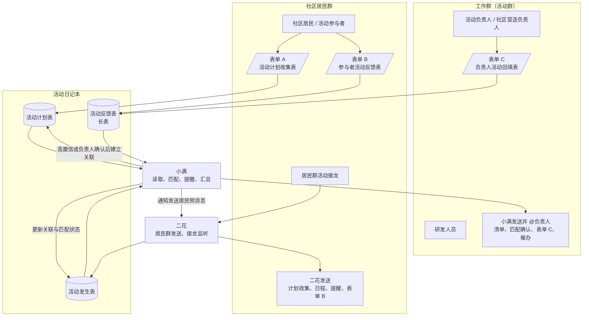

# 小满活动提醒与活动日记本最简工作流

状态：精简草案，供流程评审；不包含线上改动

日期：2026-07-30

## 1. 两个群

流程里有两个不同的群，不能混用：

| 群               | 成员                                 | 消息发送者                 | 主要用途                                     |
| ---------------- | ------------------------------------ | -------------------------- | -------------------------------------------- |
| 社区居民群       | 社区居民、活动参与者和潜在活动发起人 | 小满生成内容，通知二花发送 | 收集活动计划、发布日程和提醒、收集参与者反馈 |
| 工作群（活动群） | 研发人员、活动负责人、社区营造负责人 | 小满直接发送               | 协作、监控流程、确认接龙匹配、催办负责人回填 |

工作群中的每一条小满工作消息都要 `@活动负责人 / 社区营造负责人`。如果两者是同一人，只需
`@` 一人；如果是两个人，则同时 `@`，并提前指定谁负责回填。

二花只承担社区居民群的消息发送和接龙监听，不负责向工作人员发送消息。

## 2. 活动日记本

活动日记本在测试期作为共享数据中转站，包含三张表：

| 数据表     | 一条记录代表什么                       | 主要写入者             |
| ---------- | -------------------------------------- | ---------------------- |
| 活动计划表 | 一项活动计划                           | 活动发起人或代填负责人 |
| 活动发生表 | 一次实际发起的群接龙 / 活动发生        | 二花                   |
| 活动反馈表 | 一个人对一场活动的一次反馈或负责人回填 | 飞书表单               |

活动反馈表是一张长表。一条活动发生记录可以关联多条反馈记录，例如两条参与者反馈加一条负责人回填。

## 3. 三个工作表单

### 表单 A：活动计划收集表

- 类型：活动计划表的飞书多维表格表单视图；
- 当前表单：“太棒了！你要发起活动了~”；
- 发送位置：每周六、周日，由小满通知二花发到社区居民群；
- 填写人：想发起活动的社区成员；发起人不方便时由社区营造负责人代填；
- 写入：活动计划表。

### 表单 B：参与者活动反馈表

- 类型：活动反馈表的飞书多维表格表单视图；
- 发送位置：活动结束后的约定时间，由小满通知二花发到对应社区居民群；
- 填写人：活动参与者；
- 写入：活动反馈表；
- 必填：本次活动、一次简短评分；
- 可选：感悟、建议、照片、公开使用授权和署名授权。

表单 B 应控制在约 30 秒内完成，不要求每个参与者写长文字或上传照片。

### 表单 C：负责人活动回填表

- 类型：同一张活动反馈表的另一个飞书多维表格表单视图；
- 发送位置：活动结束后，由小满直接发到工作群并 `@负责人`；
- 填写人：活动负责人或社区营造负责人；
- 写入：活动反馈表；
- 必填：本次活动、是否完成、实际人数、活动小结；
- 可选：照片、异常情况和改进建议。

表单 B 和表单 C 不是两张新数据表。它们是同一张活动反馈表的两个入口，只是面向对象、显示字段和必填要求不同。

活动发生表不设人工表单，继续由二花根据居民群里的接龙直接写入。

## 4. 两类关联

### 4.1 反馈与活动发生的关联

首版在表单 B 和表单 C 中都设置必填项“本次活动”，显示为“日期 + 社区 + 活动主题”。填写者选择一次后，反馈记录就会直接关联活动发生记录，Base 自动形成反向关联并汇总反馈数、评分和照片，不需要工作人员提交后再维护。

正式配置前需要验证：未登录飞书的社区居民是否可以通过共享链接选择关联活动并上传附件。如果公开表单不支持关联记录，则改用可见的活动选项和 Base 自动化完成关联。

真正零选择需要活动专属链接携带上下文，后续再做，不放入最简首版。

### 4.2 活动计划与活动发生的关联

接龙本身没有活动 ID，文案也不一定与计划完全相同，因此由小满负责匹配，二花不猜：

1. 二花把接龙写入活动发生表，暂不关联计划。
2. 小满先按群、计划状态和时间范围筛选候选计划。
3. 小满再比较活动主题、介绍、地点和接龙原文。
4. 只有一个明显候选时，小满通过受限写入动作建立双向关联。
5. 有歧义时，小满在工作群 `@负责人`，让负责人选择候选计划或“即兴活动”。
6. 即兴活动不关联活动计划表。

## 5. 最简时间流程

| 时间            | 社区居民群           | 工作群（活动群）                       | 数据动作                         |
| --------------- | -------------------- | -------------------------------------- | -------------------------------- |
| 每周六、周日    | 二花发送表单 A       | 小满可发送收集进度并 `@负责人`         | 新增活动计划                     |
| 前一天晚上      | 二花发送次日活动预告 | 小满发送完整清单，提醒未发接龙的负责人 | 合并读取计划表和发生表           |
| 每天早上        | 二花发送今日活动安排 | 小满发送今日工作清单并 `@负责人`       | 再次合并两张核心表，纳入即兴活动 |
| 活动前约 1 小时 | 二花发送参与提醒     | 小满提醒负责人确认接龙和现场准备       | 更新提醒状态                     |
| 活动后约 2 小时 | 二花发送表单 B       | 小满发送表单 C 并 `@负责人`            | 参与者反馈和负责人回填进入反馈表 |
| T+24h / T+48h   | 不公开催办负责人     | 未交表单 C 时，小满继续 `@负责人`      | 最后标记待人工跟进               |

前夜预告和早间通知都必须同时读取活动计划表与活动发生表：

- 已关联的计划和发生记录合并为一场，只通知一次；
- 只有计划记录时显示“计划活动 / 待发起接龙”；
- 只有发生记录时显示“即兴活动”或“待匹配”；
- 已取消活动不进入普通通知。

负责人回填是每场活动的固定动作，不等待参与者反馈不足后才提醒。

## 6. 总流程图

## 7. 首版边界

首版只做：计划收集、计划 / 发生匹配、前夜预告、早间通知、活动前提醒、参与者反馈、负责人固定回填和逾期催办。

首版暂不做宣发、海报、发布审批、自动抓取居民群照片或私聊二花反馈。

在业务流程中，活动日记本是测试期工作台；按 Agent OS 架构，Postgres /
AgentOS 仍是系统事实源。本文只更新本地草案，不授权修改飞书表格、自动化或群消息。
