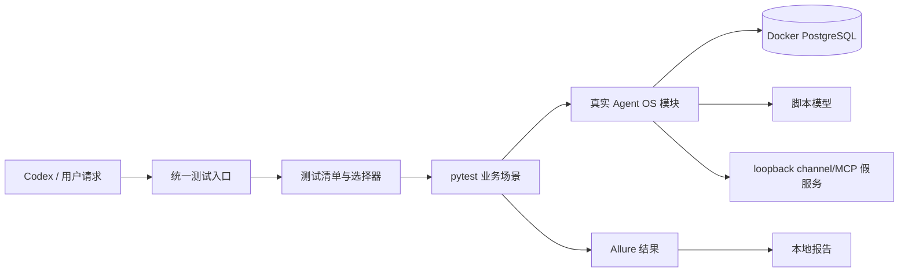

# 本地测试架构

## 目标

测试框架把“线上由事件触发的 Agent
OS 链路”搬到本地可控环境：输入、时间、模型响应、外部 channel 响应都由场景提供，事件解析、路由、授权、任务状态、Agent 执行和审计仍运行真实实现。它解决改完模块后必须部署并等待真实事件的问题，同时保留真实依赖边界的专项测试。



统一实现位于 `tools/testing/run.mjs`，提供
`setup`、`doctor`、`list`、`business`、`report`、`harness` 六个子命令；`package.json`
中的 `pnpm test:*` 是给协作方使用的短入口。运行目录固定为
`.local-testing/runs/<run-id>/`，由 `QINTOPIA_TEST_RUN_DIR` 传给测试进程。

## 组件职责

- **统一入口**：提供 setup、doctor、list、business、report、harness 命令；按 feature/scenario 选择固定执行目标，返回明确退出码。
- **测试清单**：`tools/testing/catalog.json`
  是功能别名到场景和执行器的检索入口。它校验 ID、路径、依赖和固定 runner；不储存任意命令，也不替代测试代码。
- **场景执行器**：pytest
  fixture 负责环境、seed、事件/tick、外部响应脚本、等待条件、证据和清理。业务判断由生产模块完成。
- **本地依赖管理**：每次运行创建唯一 run
  ID 和临时 Compose 项目，启动 PostgreSQL 并使用真实 migration。v1 默认不启动 NATS、MCP
  server 或真实模型；只有已登记且实现对应 executor 的专项场景才按需启动进程、NATS、MCP
  server、runner 或假 HTTP/socket 服务。
- **语言桥接**：Rust `cargo test`、Python
  `unittest`、Node 检查继续使用各自原生入口；业务清单中的 executor 仅允许
  `pytest`、`unittest`、`cargo`、`node`，能被 pytest 收集的测试可收集，其他测试按固定子进程测试组展示原始结果。
- **报告层**：`allure-pytest` 生成结果，Allure Report
  2 在本地展示业务、场景、步骤、附件和失败证据。每次运行独立结果目录，不能混入历史通过结果。

## 一次运行的生命周期

```text
选择并校验场景
  → 检查 Python / Docker / Java 17 / Allure 等依赖
  → 创建 run ID、临时目录和隔离 PostgreSQL
  → 执行真实 migration 和场景 seed
  → 注入事件或可控时间 tick
  → 驱动 worker、Agent、MCP 或 channel 边界
  → 等待明确状态并写入步骤/调用轨迹
  → 断言结果与禁止副作用
  → 生成 Allure 报告
  → 保留失败证据并清理本次资源
```

场景默认串行，避免共享数据库配置和外部替身互相污染。worker 必须按单步或有界模式运行；无限循环、固定 sleep 和无上限重试不能作为测试完成条件。中断和清理失败都要出现在运行摘要中。

## 两种执行模式

**业务场景模式**是日常默认模式：真实业务模块和本地 PostgreSQL 运行，模型与平台网络在边界替换。它适合事件映射、定时 tick、Agent 任务交接、MCP 工具行为、审批、幂等和 channel 请求/回执状态。

**进程/传输模式**是后续按需登记的专项能力：启用真实进程、NATS、MCP transport、Unix
socket 和重启流程，验证鉴权、消息投递、重投递、断线和恢复。业务场景模式通过不代表传输模式已覆盖；v1 的基础全量不自动启动这些依赖。

真实模型评估是单独接入的后续能力，不混入本地确定性全量套件；接入后评价工具选择、任务完成率、违规调用和成本，不逐字匹配模型文案。

## 结果和安全边界

测试入口只监听本地地址，子进程只接收合成配置，不继承生产数据库地址、凭证或线上
`.env`。数据库连接通过 `QINTOPIA_SIDECAR_DATABASE_URL` 注入，运行证据通过
`QINTOPIA_TEST_RUN_DIR`
注入；两者必须绑定本次临时环境。数据库名和归属标记必须匹配本次临时环境；清理只能删除本次运行创建的资源。

场景结果区分 `passed`、`failed`、`broken` 和 `skipped`；运行摘要还包含 `running` 和
`interrupted`。环境阻断统一记录为 `broken`
并附原因。选择为空、零测试、缺依赖、超时、子进程非零退出和报告生成错误都不能被伪装为通过。退出码约定为：`0`
全部必需场景通过，`1` 业务断言失败，`2` 配置/依赖/执行基础设施错误，`130` 用户中断。

## 参考链路边界

第一条案例是二花早报文本发布：合成业务输入进入真实早报逻辑，经过真实状态/审核/确认和文本发送 worker，最后请求本地 QiWe 假服务并验证状态/审计。默认不覆盖卡片图片链、真实 Hermes
08:10 触发和真实用户送达。所有报告都必须显示该真实/模拟边界，避免把本地 API 接受误读为线上送达。
